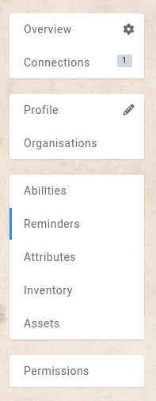
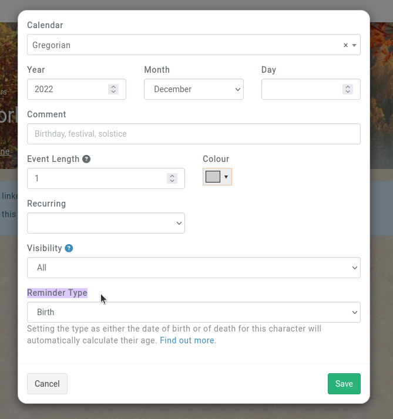
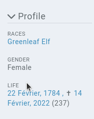

# Birth, Death, Foundation

Characters, Locations, Families and Organisations all have a special type of [reminder](/features/reminders). When creating a reminder in those entities' reminders subpage, the reminder has an **event type** field.

The **reminders** subpage if found alongside abilities, abilities, and other elements.

The **event type** field is found at the end of the new reminder form.

## Characters

Characters have the option of birth and death. If just a birth is provided, the entity's [profile sidebar](/features/profile-sidebar) will be populated with the date of birth and a calculated age based on the calendar's current date.

If both a birth and death reminder is set, it will calculate the age at death of the character in the profile sidebar.

### Limitations

Due to the dynamic nature of calendars, the calculated age of a character is not visible in the characters list of a campaign, and only visible on their profile sidebar.

## Locations, Families, Organisations

These entities have a **founded** option, which if set, displays the entity's foundation date and current age in the profile sidebar.
