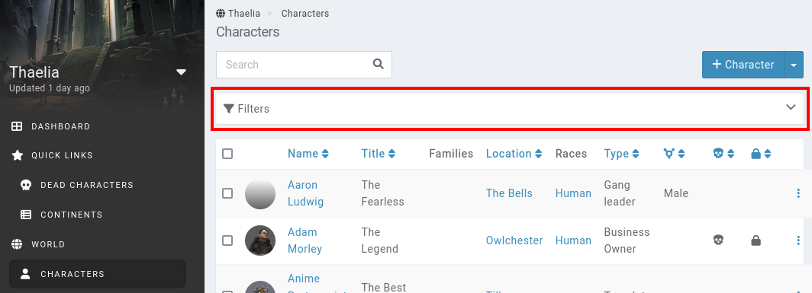
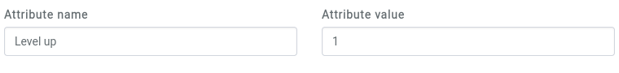
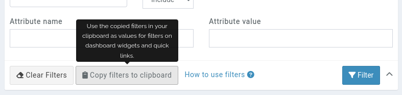

# Filters

As your campaign becomes larger and content no longer fits on a single page, for example for the world's characters, filters become an essential tool for finding the info you are searching for.

Every main list of entries accessibly from the [sidebar](/features/campaigns/sidebar) can be filtered. To open the filters, click on the **Filters** box above the list of entries.



This opens up tons of filter options.

```{admonition} Additive filters
Filters are aditive, which means that when providing a `type` and a `location` filter, only entries that match both criteria are displayed.
```

## Text matching

Text fields support various options to control in further detail what is filtered out.

* **!...**: By placing an `!` before your text, you can search for anything that doesn't contain the text in the field, this also excludes empty fields.
* **...!**: By placing an `!` at the end of your text, you can search for every entry with exactly this text in the field, this also excludes empty fields.
* **!!**: Writing `!!` in a field will search for all entries where this field is empty.

You can combine search options on text fields by writing `;`. For example `Alex;!Smith`.

Filters and ordered columns set for an entry list are saved into your session, so as long as you stay connected you don't need to re-set them on every page.

Keep in mind that some fields, like type, age, gender and pronouns for characters, role in quests and price, size and weight of objects are “explicit”, meaning that they look for exact matches and not similar matches, also excluding those entries where the filtered field is empty.

## Family, Location, Race, Organisation

You can filter entries based on their family, location, race and organisation. These search fields look for entries that have an exact match with that name. You can use the selection box at the right of the field to select between 4 different behaviours for the filter, these are: 
* **Include**: Includes all entries that are part of the entry choosen.
* **Exclude**: Excludes all entries that are part of the entry choosen.
* **With children**: Includes all entries that are part of the entry choosen and all of its children.
* **None**: Shows all entries that aren't a member of any entry of the choosen type.

## Property name

You can filter entries based on their properties. The search fields are exact matches for both the name and value. You can also search for entries that have a specific property whose value is not empty by typing `!` on the value field. When the value field is left empty, it looks for entries that have a property with that exact name, excluding those with other properties or no properties. You can type `!Level` to exclude entries with a property called Level.

The filter doesn't evaluate property calculations. If a property has a value of `{HP} * {Level}`, searching for the result of that calculation isn't possible.

### Checkbox filters

To filter on properties which are of the **checkbox** type, use the following values:

* **0** in the value field for unchecked properties
* **1** in the value field for checked properties



## Copy filters to clipboard

After filling out the filters and clicking the **Filter** button, the list of entries will be updated. At this point, in the filters box, the **Copy filters to clipboard** button becomes active. Clicking it copies the filters to the clipboard, which can be pasted in the dashboard [widget filters](/guides/dashboard#widget-filters) and [bookmark](/advanced/bookmark) **filters** fields.




