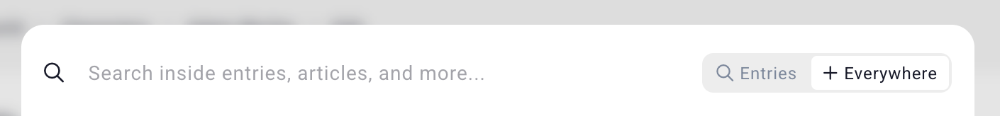
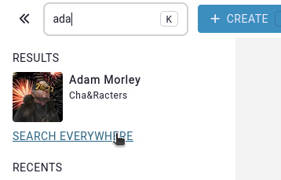
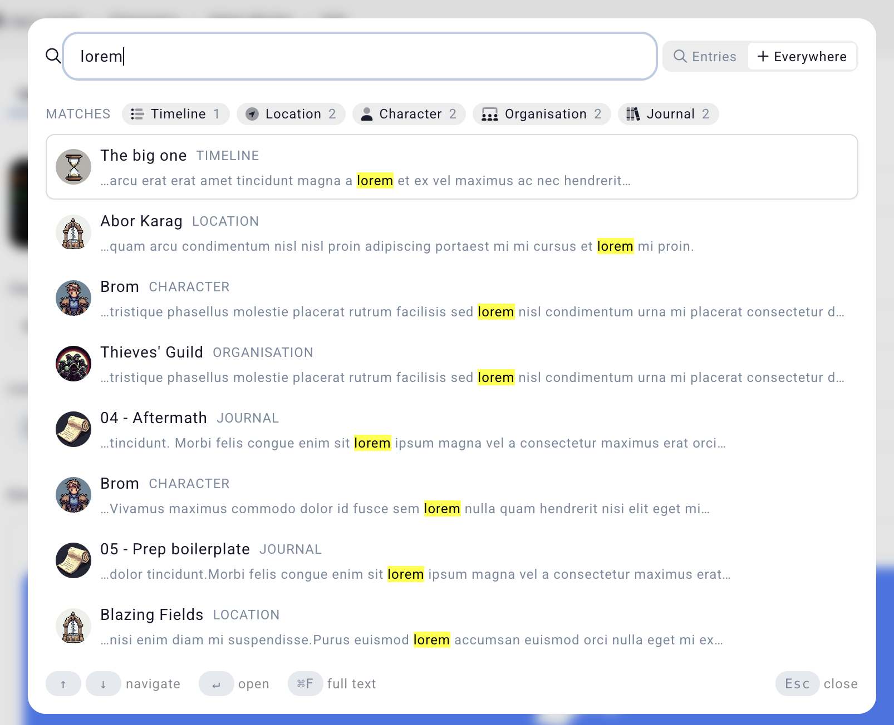

# Full-text search

In the case that you want to do a full-text search on all the contents of all entries, (i.e. properties, articles, descriptions) you can click on the "everywhere" button displayed at the top right of the [search](/features/search) panel.

This will perform the search for the search term on all the contents of the campaign, the results of the search will always be entries, for example, if the match occurs on an timeline element's name, the displayed result will be the entry that has that timeline element. The term will always be highlighted, along with a filter at the top for only showing results of a specific category.

## Number of results

Full-text search only shows up to 10 results to keep it fast. The more content the search term contains, the tighter the results. Search results are ordered by relevancy based on multiple factors (for example, an entry with the term in the name will show up higher than if the term is in article).

# Related

* [Search](/features/search)
