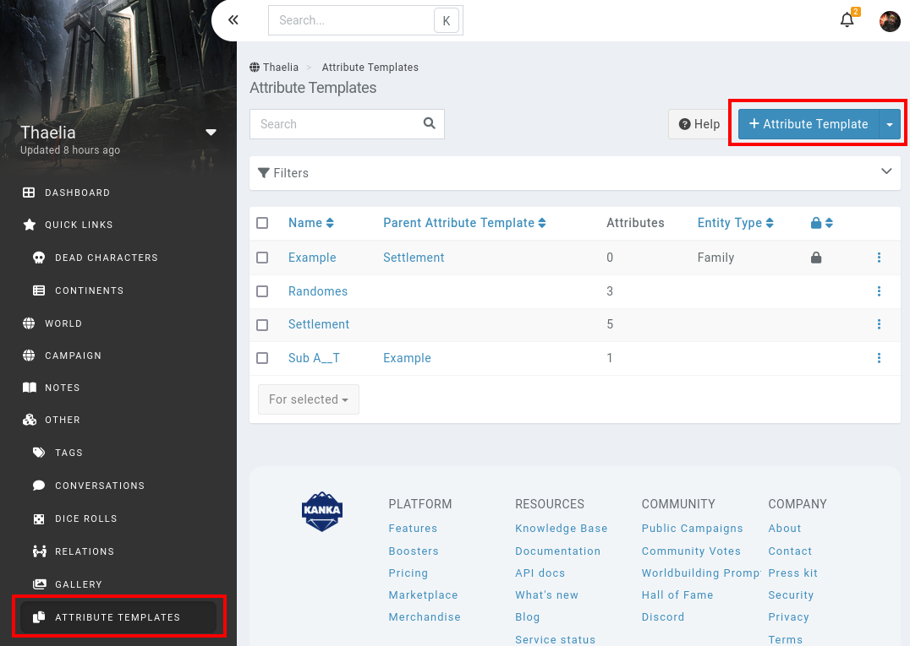

# Attribute Templates

**Attribute templates** are a complicated beast. When using [attributes](/features/attributes) on your [locations](/entities/locations), you might be re-creating the same attributes over an over. You could create a [template location](/guides/templates), or use attribute templates.

While this video has a very old interface, the concepts still hold true to this day.

## Setting up an attribute template

Say you're constantly adding the following attributes to your cities.

* **Population**
* **Wealth**
* **Crime**

Doing so each time you're adding a city is tedious, so let's make this process a lot easier, especially as you end up tracking more attributes.

In your campaign sidebar, click on **Attribute templates** at the bottom of it, and on the **+ Attribute Template** button at the top right to create a new attribute template.

### Fields

Attribute templates have the following fields.

* **Name**: The name of the new entity, in our example, let's call this one **City**.
* **Parent attribute template**: For your own organisation, you can nest attribute templates. If you end up with multiple templates focused on locations and multiple on characters, you might create a parent attribute template for that.
* **Entity Type**: If set, newly created entities of that type will automatically have the attributes of this template added to them. For example, if all of your Journals have a "leveled up" attribute, you can automate this process for new jourals. In our example, let's leave this field empty.

Next up, fill out the **Attributes** tab with our 3 example attributes from above. Save the attribute template and head on to the next step.

## Applying an attribute template

With the attribute template created, it's time to test it out. Go to your campaign's [locations](/features/entities/locations), and create a start creating a new one.

In the new location's **Attributes** tab, click on the **Attribute Template** option to list your campaign's attribute templates. This list also includes [character sheets](/plugins/character-sheets) from the [plugins library](/plugins/plugins). Select our example **City** attribute template.

This does not add the new attributes _yet_, as attribute templates are only applied when the entity is being saved. Save your new location, and you should see it's attributes going to the new location's attributes subpage.

## Resyncing attributes from an attribute template

When you add a new or change and existing attribute to a template, it does not automatically change on all entities that have the attribute template applied. You need to manually re-apply the template. Luckily, you can do this with the [bulk](/advanced/bulk) features.

## Nested attributes

We previously left the [parent](/features/nested) field empty. However, this can be incredibly useful to organise your attribute templates.

Let's say you have an attribute template called **City**, which has some attributes, and itself has two other attribute templates. When you apply **City** to an entity, it will add attributes from **City** and the children attribute templates.

## Entity Type

Setting the **entity type** field will automatically apply the attribute template to new entities. Note that this only works when creating an entity with the form. This does not work with the [quick creator](/features/quick-creator) or [new mentions](/features/mentions#new-entity).