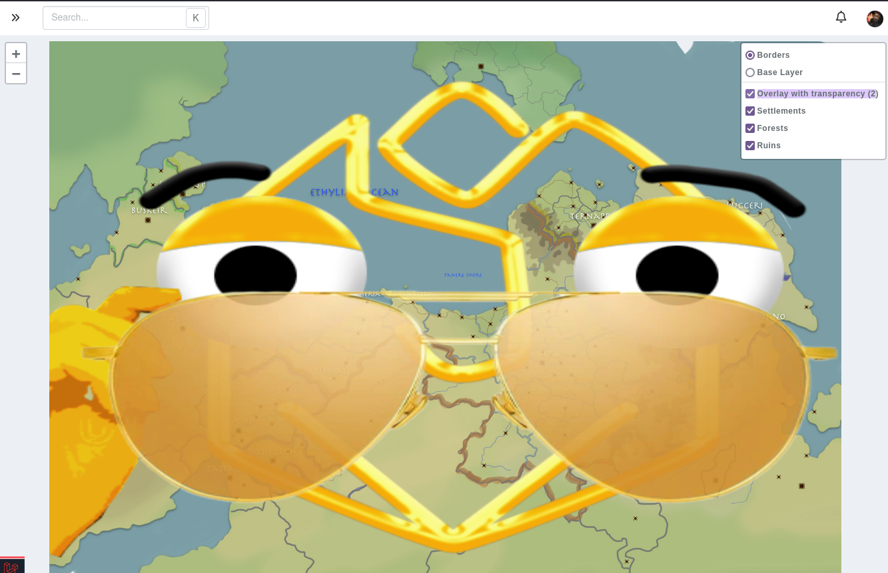

# Map Layers

Map layers are a way to upload multiple images to a map, that can be toggle to replace the map's image being displayed.

For example, let's say you have an image of a dungeon with and without traps, or a battlemap with and without a grid. The map's image will be the main image as seen by your players, and a layer can be added that represents the alternative image of the map.

## Fields

### Entry

The entry field is for your own book-keeping, for example if you have numbers visible on a layer, the entry could contain the information on what each number represents.

### Layer types

Layers have three types that control how they are displayed on a map.

* **Standard layer**: The default option, the layer will only display when clicked on.
* **Overlay (displayed above)**: When toggled to display, this layer won't hide the original map image, but be visible on top. This is great for adding an image with transparency and some details to your map.
* **Overlay shown by default**: Same as above, but this layer is visible by default when the map is opened.

_Note that overlay images will stretch to the size of the map's image_

### Permissions

Layers have the standard [visibility](/advanced/visibility) permission system, meaning you can make layers only visible to your campaign admins, or only to yourself and hidden from the other admins of your campaign.

## Limitations

Standard campaigns can have a maximum of **one** (1) layer per map, while premium campaigns can have up to **twenty** (20).

There is currently no way to have more than twenty layers per map.

## FAQ

### Can multiple layers be shown at the same time?

**Overlay** layers can be toggled each individually to be shown on top of either the map's base image or one of the standard layers.

### Can I attach markers to layers to show/hide them when a layer is visible?

No, that's what [map groups](/entities/maps/groups) are for.
