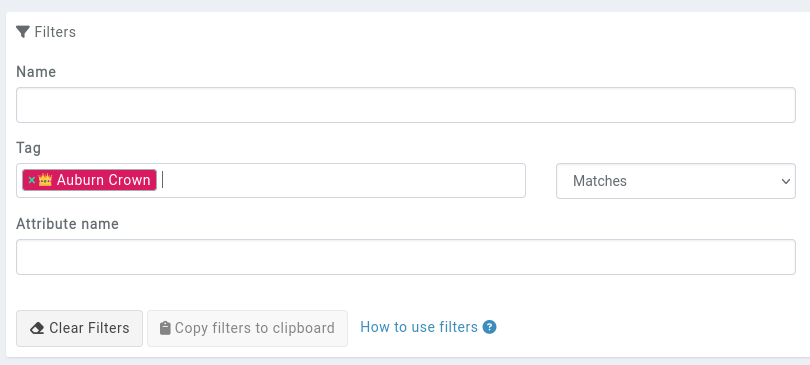
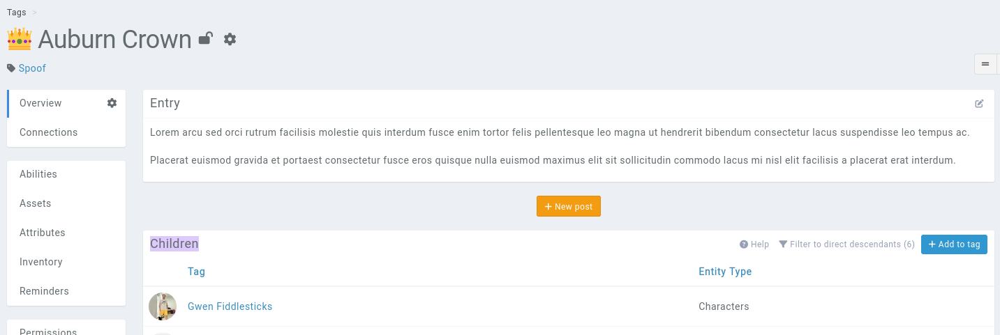
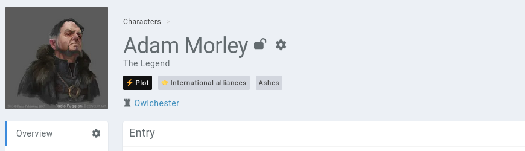
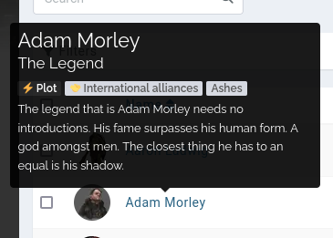
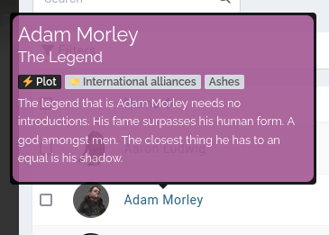

# Tags

The bestest module of Kanka. Tag everything. Tag freely. If you're scared of losing track of something you've created, tag it. 


## Finding tagged entities

To find tagged entities, you can either filter for tags in the lists using the tag [filter](/advanced/filters) like this:



Or when viewing a tag, the **children** box contains all the tagged entities.




## Seeing an entity's tags

An entity's tags are displayed in the top of all of its pages, below its name.




Tags of an entity are also visible in the entity's tooltip.




## Auto-applying tags

Tags can be set to **automatically apply** to new entities, so all your new entities can have a **STUB** tag until you've filled out their backstory and found their purpose in your story. This option is available when creating or editing a tag.


## Styling tooltips based on tags

Tooltips can be styled based on their entity tags. For example, if you want all your entities tagged with a tag named **Plot** to have a special layout, add the following to your [campaign themes](/features/campaigns/theming).

```css
.tooltip-content.kanka-tag-plot {
  background-color: hsl(313 30% 49%);
  padding: 0.33rem;
  border-radius: 0.5rem;
}
```

This example will give the following results.


