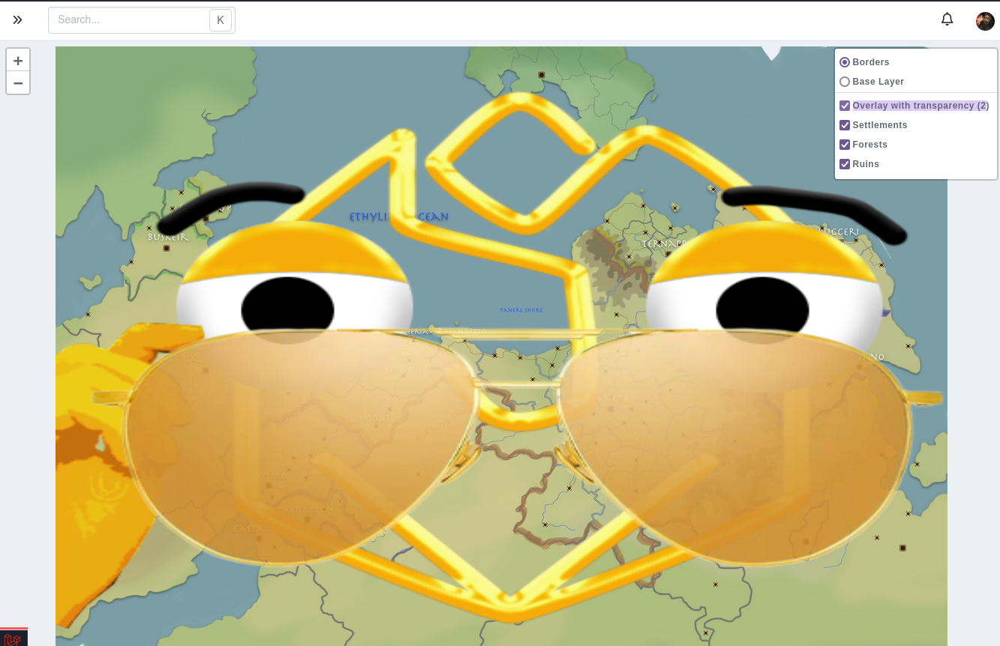

# Map Layers

Map layers are additional images for a map. Create and manage them from the map's regular edit page; Map Explorer is the primary place for viewing and creating markers.

For example, you can make a dungeon map with and without traps, or add a transparent layer containing a grid or political borders.

## Fields

### Entry

The description field is for your own book-keeping, for example if you have numbers visible on a layer, the description could contain the information on what each number represents.

### Layer types

Layers have three types that control how they are displayed on a map.

* **Standard layer**: an alternative map image, intended for the legacy map interface.
* **Overlay (displayed above)**: an optional transparent image displayed over the base map in the legacy map interface.
* **Overlay shown by default**: a transparent image that Map Explorer displays automatically above the base map. Use this for information that should always be visible, such as borders or a grid.

Map Explorer currently displays layers that are set to **Overlay shown by default**. It does not include the old layer-switching controls for standard and optional overlay layers.

_Overlay images stretch to the size of the map image._

### Permissions

Layers have the standard [visibility](/advanced/visibility) permission system, meaning you can make layers only visible to your campaign admins, or only to yourself and hidden from the other admins of your campaign.

## Limitations

Standard campaigns can have a maximum of **one** (1) layer per map, while premium campaigns can have up to **twenty** (20).

There is currently no way to have more than twenty layers per map.

## FAQ

### Can multiple layers be shown at the same time?

In the legacy map interface, **Overlay** layers can be shown individually on top of the base image or a standard layer. In Map Explorer, every **Overlay shown by default** layer is displayed.

### Can I attach markers to layers to show/hide them when a layer is visible?

No. Use [map groups](/entries/maps/groups) to organise markers instead.
