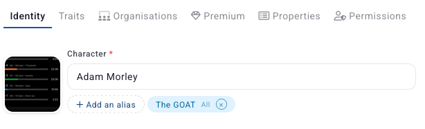

# Aliases

Set aliases on entries to help find them in the [search](/features/search) and in [mentions](/features/mentions). Free campaigns can have 2 aliases set for the whole campaign, while [premium campaigns](https://kanka.io/premium) have unlimited aliases.

## Defining an alias

To add an alias to an entry, navigate to that entry's **Edit** form. From there, you can add any number of aliases

Each alias has a [visibility](/advanced/visibility) option to control who in the campaign find the entry using the alias.

## Mentions with an alias

When adding a [mention](/features/mentions) to an entry through the alias, the alias's name is used to render the mention.

## What happens to the campaign's aliases when the campaign looses its premium status

Should the campaign no longer benefit from premium features, defined aliases keep existing, but it is no longer possible to add any new ones, unless all but one has been deleted.
