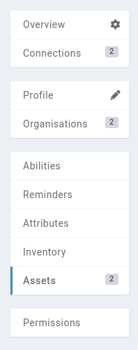

# Aliases

[Premium campaigns](https://kanka.io/premium) can set aliases on entities to help find them in the [search](/features/search) and in [mentions](/features/mentions).

## Defining an alias

To add an alias to an entity, navigate to that entity's **Assets** subpage.

From there, click on the **+ Alias** button on the top right.

Each alias has a [visibility](/advanced/visibility) option to control who in the campaign find the entity using the alias.

## Mentions with an alias

When adding a [mention](/features/mentions) to an entity through the alias, the alias's name is used to render the mention.

## What happens to the campaign's aliases when the campaign looses its premium status

Should the campaign no longer benefit from premium features, aliases won't work for both search and mentions. Re-enabling premium features on the campaign will re-activate all the campaign's aliases.