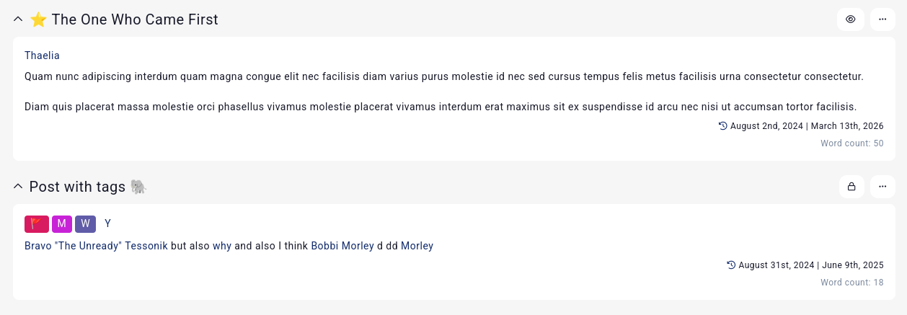
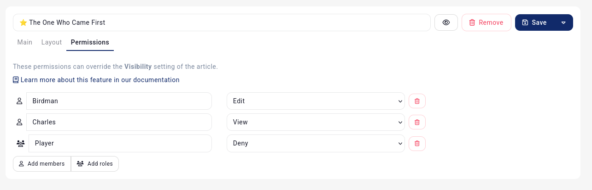
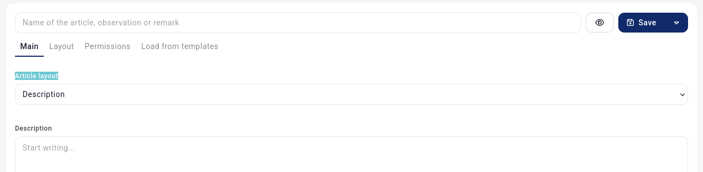
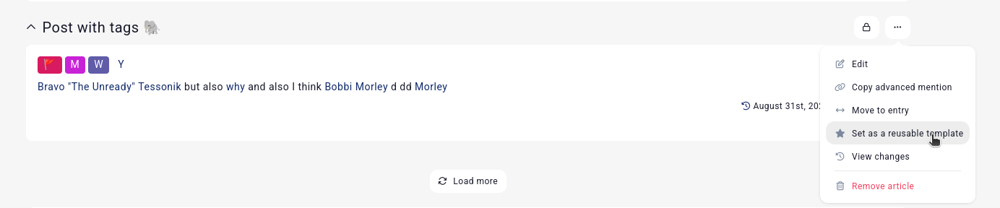
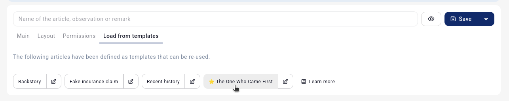

# Articles

Every entry has a single description field, but can have many articles. Articles are, fundamentally, just more description fields for an entry.

Articles have a name, for example, you might want to add a **Backstory** post to a character. They can also have a location, for example if the backstory was in the town they grew up in.

## Permissions

Players who can edit an entry automatically get to edit their articles. If you don't want to allow your players from editing an entry, but still add articles (for example their notes/clues about an NPC), you can give their role permission to edit the articles of the entry in the [permissions](/features/permissions) subpage of the entry.

## Hidden information

Articles can also be made invisible to other players by using the [visibility option](/advanced/visibility), or using the **advanced permissions** tab when creating or editing an article. For example, you can deny an article being visible to an individual member or role.

## Special layouts

When creating a new article, [Premium campaigns](https://kanka.io/premium) can set the article to display a subpage or special content instead of text. For example, you might want the character's sheet/properties to be visible directly on the overview.

## Templates

If you're often recreating the same article on multiple entries, you can set articles as templates.

Then, when creating a new article, you can load from your templates.

