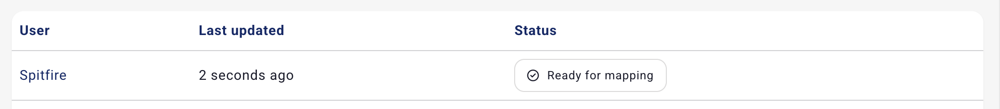
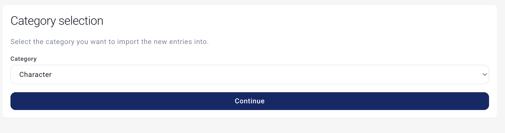
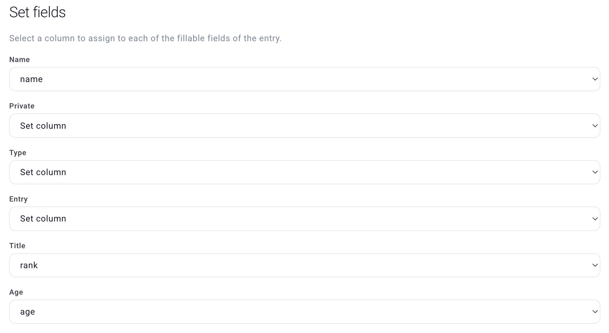
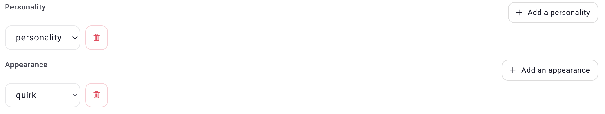
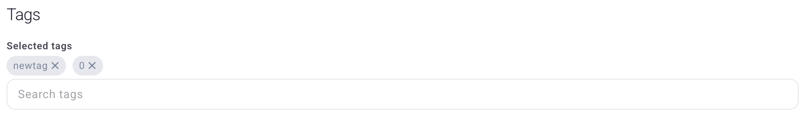
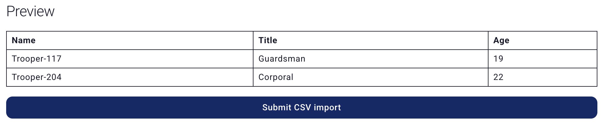

# CSV Import

The CSV import feature lets you bulk-create entries in your campaign by uploading a CSV file. Instead of manually creating each character, location, or item one by one, you can prepare your data in a spreadsheet and import it all at once.

This feature requires a **Wyvern** or **Elemental** subscription.

## Preparing Your CSV File

Your CSV file needs to follow these rules:

### Format

Standard CSV format — columns separated by commas. Most spreadsheet apps (Google Sheets, Excel, LibreOffice Calc) can export to CSV.

The first row must be a **header row** — each cell in the first row should contain the name of that column (e.g. Name, Title, Age). These headers are what you'll see when mapping columns to fields.

If a column contains text with commas, line breaks, or special characters, wrap the value in double quotes (`""`). For example, `"Leader of the city watch, known for her iron will."`. Without the quotes, commas inside the text will be treated as column separators, which can make the file invalid or cause data to shift into the wrong columns.

### The "Fully Filled Column" Rule

The **Name** field is mandatory for every entry. To ensure a reliable import, the Name field can only be mapped to a CSV column where every row has a value (no empty cells).

For example, if your CSV has 100 rows but column A has 3 empty cells, that column cannot be used for the Name field. Only columns with no gaps will appear as options when mapping the Name.

If no column in your CSV is fully filled, the file will be rejected as invalid, since the required Name field cannot be mapped.

Other fields (like Description, Type, etc.) can be mapped to any column, even ones with some empty cells.

### Boolean Values

Some fields are true/false toggles (like Private, Extinct, Destroyed, etc.). For these fields, your CSV can use any of the following values:

| True | False |
| --- | --- |
| true | false |
| 1 | 0 |
| on | off |

### Example CSV

```csv
Name,Title,Age,Sex,Description,Is Private
Alara Wing,Captain of the Guard,34,Female,"Leader of the city watch, known for her iron will.",false
Brendan Thatch,Innkeeper,52,Male,Runs the Rusty Flagon tavern.,false
Celia Dorn,Court Mage,28,Female,Advisor to the king on matters of the arcane.,true
```

## Import Workflow

### Step 1: Upload Your File

Navigate to your campaign's Import page (`Campaign sidebar > Import`). Select your `.csv` file and upload it. A progress bar will show the upload status.

Once uploaded, the system validates your file in the background. You'll receive a notification when it's ready for the next step.



### Step 2: Select an Entry Type

Choose which type of entry you want to create from the dropdown (e.g. Characters, Locations, Items). All rows in the CSV will be imported as the same entry type.

If you need to import different entry types, create separate CSV files for each and run a separate import for each one.



### Step 3: Map Columns to Fields

This is where you pair each CSV column with the corresponding entry field:

**Name** (required) — select which CSV column contains the entry names. Only fully filled columns are available here.

All other fields are optional — map them to whichever CSV column contains the matching data, or leave them unmapped to skip.



If you're importing Characters, you'll also see options to map columns to **personality traits** and **appearance traits**. The column header becomes the trait name, and each row's value becomes that trait's content.



You can also assign **tags** to all imported entries at this stage.



### Step 4: Preview and Submit

A preview table shows how your mapped data will look for the first few rows. Review it to make sure the mapping is correct, then submit.



The import runs in the background — you can continue using Kanka while it processes. You'll receive a notification when the import finishes (or if it fails).

## Supported Entry Types

The following entry types can be imported via CSV:

* Characters
* Locations
* Families
* Organisations
* Items
* Notes
* Events
* Quests
* Journals
* Races
* Tags
* Abilities
* Maps
* Timelines
* Creatures
* Custom entry types (if your campaign has them)

**Not supported** for CSV import: Calendars, Conversations, Attribute Templates, Dice Rolls, Bookmarks, and Whiteboards.

## Available Fields

### Fields Available for All Entry Types

| Field | Description |
| --- | --- |
| Name | The entry's name. Required. |
| Description | The main text/description of the entry. Newlines in the CSV will be preserved. |
| Type | A freeform label for categorizing the entry (e.g. "NPC", "City", "Longsword"). |
| Private | Whether the entry is private (hidden from players). See boolean values above. |

Each entity type also has their own fields available.

### Character Traits

When importing characters, you can map CSV columns to **personality traits** and **appearance traits** separately from the main field mapping. For each trait:

* The **column header** in your CSV becomes the trait name (e.g. "Ideals", "Bonds", "Hair Color").
* The **cell value** in each row becomes the trait description for that character.

You can add multiple personality and appearance trait mappings.

## Tips and Troubleshooting

* **"No columns available for Name"** — Your CSV needs at least one column where every row has a value. Check for empty cells in the column you want to use as the Name.
* **Import one entry type at a time** — Each CSV import creates entries of a single type. Split your data into separate files if you need to import different types.
* **Formatting text in Description** — Newlines in your CSV's Description column will be converted to line breaks. For richer formatting, you can edit the entries after import.
* **Tags** — You can assign existing tags to all imported entries during the mapping step. This is useful for organizing or filtering your newly imported data.
* **The import failed** — If something goes wrong, you'll receive a failure notification. Common causes include malformed CSV data or validation errors (e.g. a Name value exceeding length limits). Fix the issue in your CSV and try again.
* **Column headers matter** — Use descriptive headers in your CSV. They'll appear in the mapping dropdowns and become trait names for character imports.
