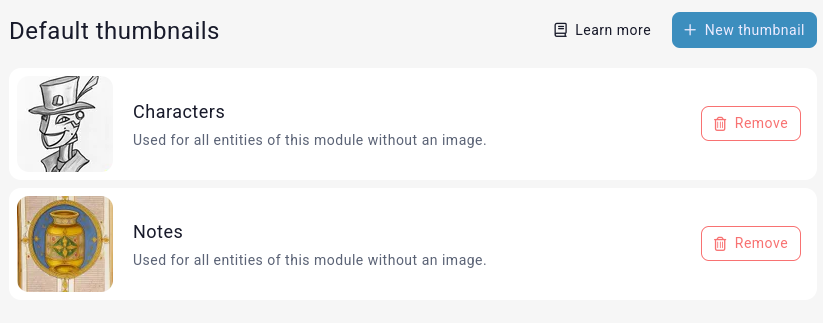

# Default thumbnails

[Premium campaigns](https://kanka.io/premium) have an interface to define default thumbnails for entities with no attached image. This interface is available in `Settings > Default Thumbnails`. 

## Thumbnails

Thumbnails are uploaded for each entity type. For example, a default thumbnail can be uploaded for characters. When done this way, each character with no defined image will show the default thumbnail in the various lists of the campaign.

Default thumbnails are visible to all members and viewers of a campaign, but only members of the campaign's admin role can change them.