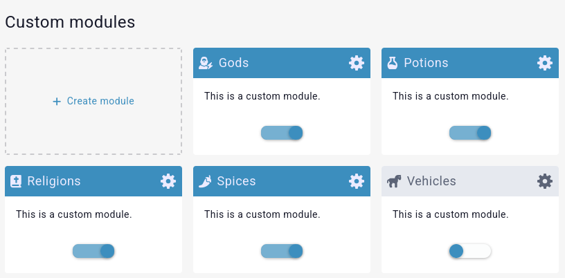
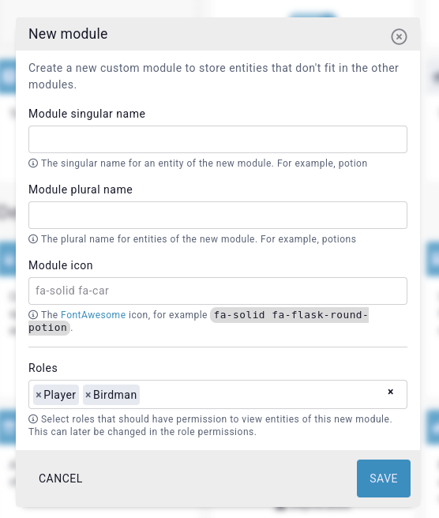
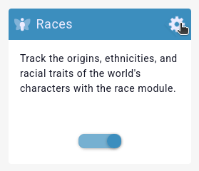

# Modules 

We've built Kanka with about two dozen modules that interact with each other and help you organise your worlds. If our pre-determined modules don't quite fit your needs, premium campaigns can also create their own.

Accessing your world's module is done by clicking `Settings` in the sidebar, and then going to the `Modules` subpage (or searching for `Modules` in the lookup field at the top of the page). This interface splits into three distinct sections.

## Custom modules

The first section is reserved for your custom modules. 



Custom modules have a singular name to describe an entity, a plural name to describe multiple entities, and an icon used for the sidebar and quick creator interface. Additionally, when creating a new module, you can directly set roles that have access to entities creating in the new module.



Once created, the new module is visible in the [Bookmarks](/advanced/bookmarks) section of the sidebar and as an option in the quick creator.

### What happens when a campaign is no longer premium

If a campaign loses its premium status, existing custom modules remain accessible. You can still view, edit, and delete entities within those modules, but you will no longer be able to create new entities using custom modules.


## Default modules

Each world comes with the afromentioned pre-determined default modules, and they are automatically all enabled, except for the deprecated [conversations](/entities/conversations) and [dice rolls](/entities/dice-rolls) modules.

```{admonition} Info
Disabling an entity type doesn't delete the related data from the campaign. Instead, it is simply **hidden**. Only members of the campaign's admin role can enable or disable modules.
```

### Customising module names and icons

If you'd rather the [Race](/entities/races) module be named `Folk` throughout your Kanka campaign, you can do so. Click on the cog wheel in the module's box you want to change.



This brings up an interface to update the module's singular and plural name, as well as its icon. This works well for English and non-gendered languages, but will lead to weird sentences in every other one. 


### Module icon

The module icon field can be filled out with a [FontAwesome or RPGAwesome](/features/campaigns/sidebar#what-fonts-are-available) class.

## Features

At the bottom of the page you'll find features that can be turned off. For example, if you don't need inventories or assets in your campaign. Most features are such an integral part of Kanka that they cannot be turned off. However, you can hide them with some [custom CSS magic](/features/campaigns/theming).