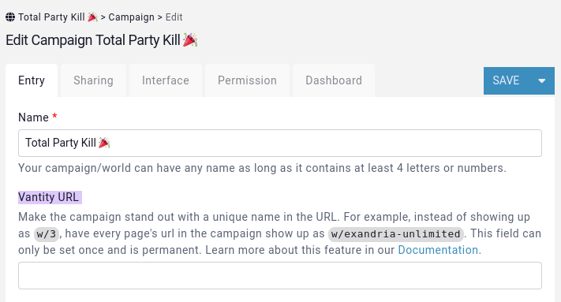
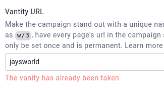
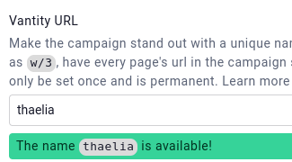

# Vanity URL

Premium campaigns can set a vanity url for their campaign, which will appear in the URL of every page of the campaign.

## Where can I set the vanity url

To set the vanity url of the campaign, head over to the campaign edit form, which is found in the sidebar under `Settings` and clicking the `Edit campaign` button.

## Rules

To set a vanity url on a campaign, the following must be true

* The campaign must be premium (doesn't work for the legacy boosted/superboosted campaigns).
* The campaign must not yet have a vanity url.
* The vanity url must contain at least 4 characters, of which at least one needs to be a letter.
* The vanity url cannot contain any speclial characters like `/`, `|`, `#`, `?`, `'`, `"`, `é` etc. Typing in a special character will automatically remove it when the field loses focus.
* The vanity url must be unique among all other campaigns.

When the field loses focus, it will check if the vanity url is valid or not and warn you.

## Play nice rules

The Kanka team monitors vanity urls and will disable those who break the Kanka terms of service.

## Duration

Once set, the vanity url cannot be removed, but stays even if the campaign is no longer premium.
