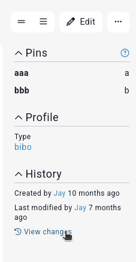
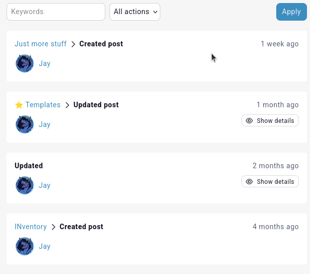
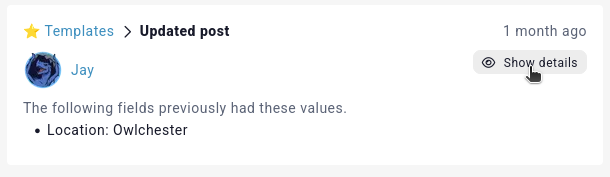
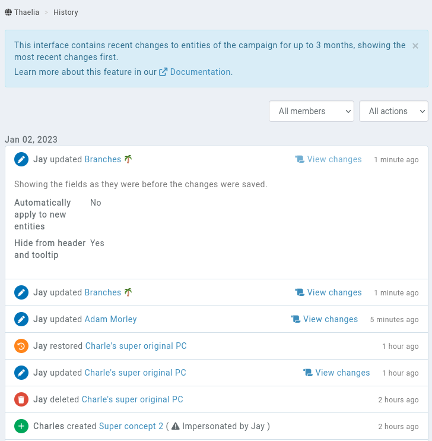

# History

Whenever an entry is created, modified, deleted or [restored](/features/campaigns/recovery), a log is saved with that information for 90 days.

## Entry history

An entry's history can be view directly on it. When on the overview page of an entry, scroll down and click on the **View changes** link.



This brings up a summary of changes recently done to the entry.



### Full save logs

[Premium campaigns](https://kanka.io/premium) get access to the full changes made to an entry in this interface. When saving an entry, the previous values are saved in the log, and is available for 30 days.

Clicking on the **Show details** link reveals the previous values.



```{admonition} Warning
Note that the campaign **already needs to be **premium** when making changes for the old values to be saved. Unlocking premium features on a campaign after an entry was changed won't give you access to the old values.
```

#### Limitations

These logs don't track changes to sub-elements of an entry, for example properties, articles, reminders, etc. Only changes on values directly related to the entry are logged.

## Unified interface

Members of a [premium](https://kanka.io/premium) campaign's admin role get access to a **History** page, accessible towards the end of the sidebar [by default](/features/campaigns/sidebar). This displays the changes done on the whole campaign, with filters available for specific members or specific actions.

The full entry changes are available on the **Changes** button.




## Notifications

Notifications can be sent through [webhooks](/features/campaigns/webooks).