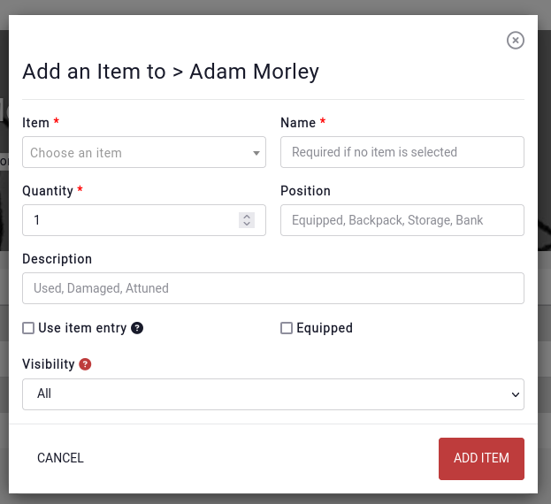

# Inventory

Every entity has a subpage called "Inventory" which is intended to track an entity's inventory. This makes sense when using Kanka for running a TTRPG.

## Why all entities?

A quest's inventory might be the planned loot. A location's might be a shop's sales. An org's might be the group's shared loot.

## Adding an item

When adding an item to the inventory, either a name can be provided, or a link to an existing entity.

## Layout

Items in the same "Position" get grouped together.

Whole positions can be collapsed by clicking on their name. Items can quickly be added to a position by clicking on the "+" button. A whole position can be deleted by clicking on the trash icon.

### Item details

Clicking on an item opens up more details about it. If the item is linked to an object entity, the object's location, weight, size and other details will be displayed.

