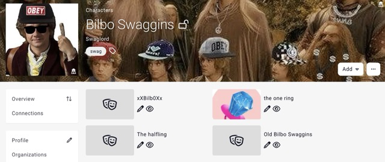
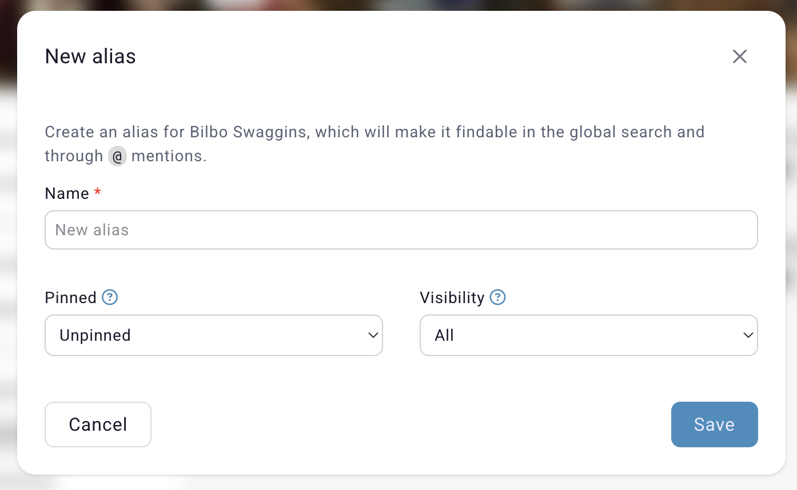

# Media

Every entry has a subpage called "Media" which contains miscellaneous content that is related to the entry.

The first media type are [Aliases](/features/aliases), which can be used for search and mentions, these are limited to 2 for free campaigns and unlimited for premium campaigns.

The second media type are uploaded **files** to the entry. By default, an entry can have 3 files attached to it, generally an image, pdf, or image. [Premium](https://kanka.io/premium) campaign can have **10** files attached to each entry.

Lastly, the third media type are **links**. For example, if a character has a character sheet in DndBeyond, or you wish to attribute the image used on the entry, adding a link to that resource outside of Kanka will add the link in the entry's [profile sidebar](/features/profile-sidebar).

