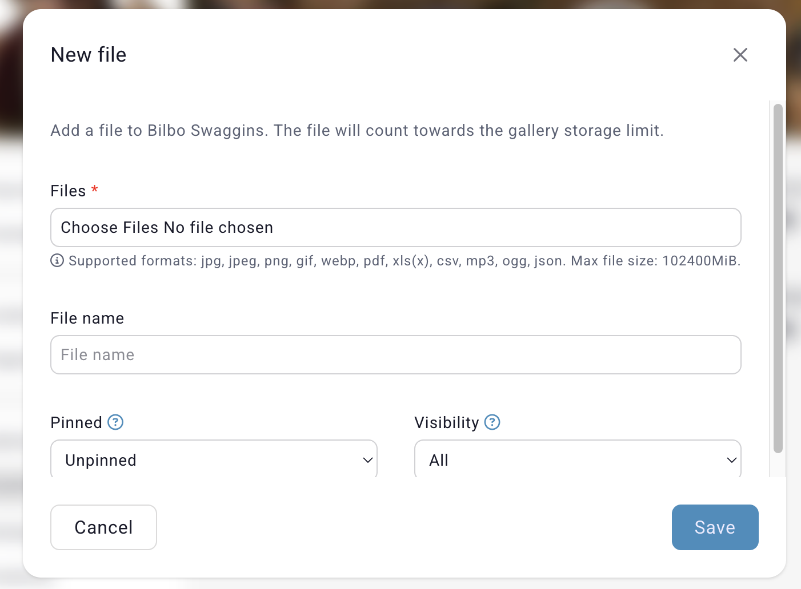
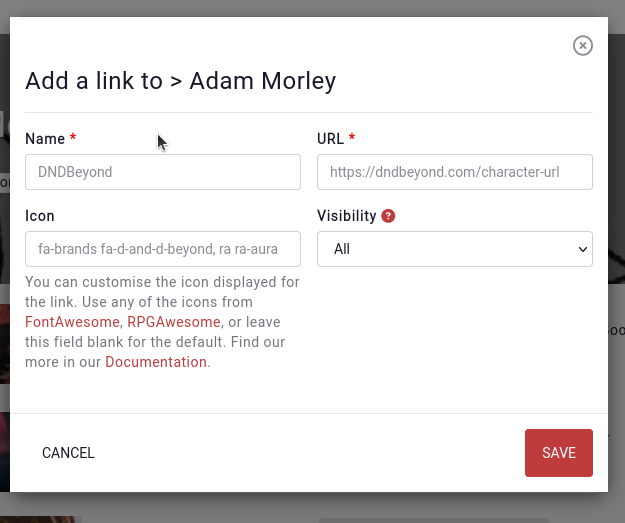

# Media

Every entry has a subpage called "Media" which contains media assets that are related to the entry.

## Files
The first media types are uploaded **files** to the entry. By default, an entry can have 3 files attached to it, generally an image, pdf, or image. [Premium](https://kanka.io/premium) campaign can have **10** to unlimited files attached to each entry.

## Links
Lastly, the third media types are **links**. For example, if a character has a character sheet in DndBeyond, or you wish to attribute the image used on the entry, adding a link to that resource outside of Kanka will add the link in the entry's [profile sidebar](/features/profile-sidebar).

## Aliases

In previous versions of Kanka, aliases were considered a media type. They now live directly in the entry's form instead, and automatically show up on the entry's profile sidebar.