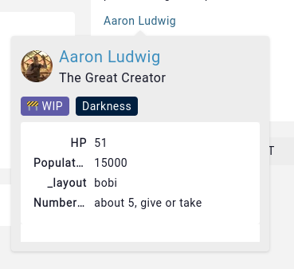
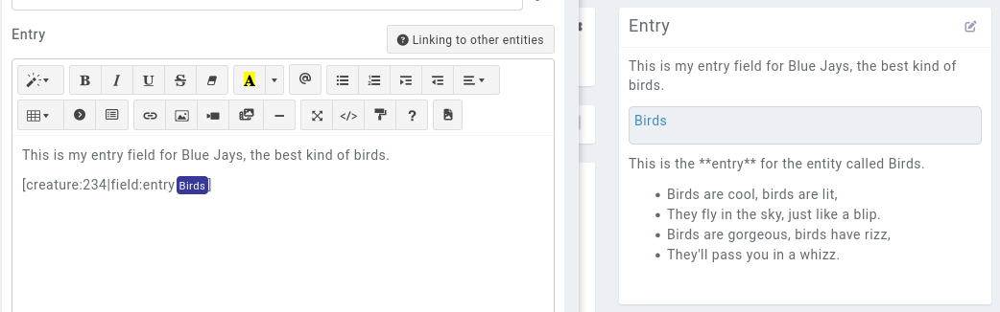
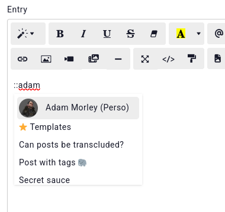
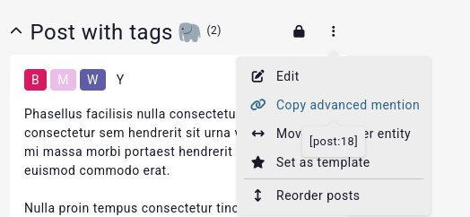

# Mentions

[](https://youtu.be/GLVI3XV5PO0)

In the description field of an entry or articles, you can type `@` followed by 3 characters to search for an entry of the campaign. This searches on the `name` of entries. By default, recently modified entries appear at the top of the list.

## Filtering

If you have several entries with similar names, the following features can help find exactly what you want.

* Replace each ` ` (space) with an `_` (underscore) to search for entries with spaces in their names. For example, `@Drizzt_Do'Urden_The_Wise`.
* Type `@=Greg` to find an entry that has **exactly that name**. The `=` (equal) sign at the beginning gets removed from the search, so avoid using `=` as the first letter of your entry names.

## New Entry

If you want to mention an entry that doesn't yet exist, you can type `@New_Entity_Name`. If Kanka finds no entry with that name, it will suggest creating a new entry with that name. This injects the `[new:entity_type|New Entry Name]` syntax. When saving, these mentions are parsed and transformed into new entries. 

## Advanced mentions

Link to other entries by typing `[` and the first few characters of an entry to search for it. This will inject `[entity:123]` in the text editor. To customise the name of the entry displayed, you can type `[entity:123|Alex]`. Not that the `|` and `:` characters aren't allowed in custom names. 

### Linking to a specific subpage

Instead of having the link fo to the entry's overview page, the advanced mention can be set to go to the entry's subpage. Use the `[entity:123|page:xxx]` syntax, replacing `xxx` with one of the following options:

* `abilities`
* `assets`
* `properties`
* `inventory`
* `relations`
* `reminders`

Some entries like quests have a `quest-elements` subpage as a valid option.

The advanced mention can also specify the HTML anchor the link should point to using `[entity:123|anchor:post-69]`.

### Displaying a field instead of the entry's name

You can also display a field from the entry instead of its name in the link with `[entity:123|field:location]`. Some available options are `type`, `location`, `pronouns`, and `title`, as well as the parent field of [nested](features/nested) entries. For example to mention a family's parent family, use `[entity:123|field:family]`. It isn't possible to reference a character's families or races, as characters can have several of those.

Here is a quick rundown of allowed fields for most entries.

* name
* type
* location _(for entries that have a location)_
* parent _(for entries that have a parent like creatures, maps, timelines)_
* Fields available for **characters**
  * title
  * sex _(shows the gender)_
  * age
  * pronouns
  * location
* Fields available for **locations**
  * parentLocation
* Fields available for **journals**, **calendars** and **events**
  * date
* Fields available for **quests** and **journals**
  * calendar_date
* Fields available for **items**
  * character
  * price
  * size
  * weight
* Fields available for **abilities**
  * charges
* Fields available for **tags**
    * colour
* Fields available for **maps**
    * map

## Preview Maps

A mention to a map type entry with the field parameter set to map will render a 300px x 300px preview of the map's explore page, the dimentions may be customized filling the `height` and `width` parameters, for example `[map:131|field:map|params:width=500&height=400]`.

## Mentioning properties

Referencing properties of this entry is also possible. Simply type `{` and three letters or more to display matching properties on the entry. This injects `{attribute:123}`, 123 being the property's unique number in Kanka. You can copy-paste this reference in other entries to reference properties from other entries.

### Properties / Character sheets in the tooltip

```{admonition} New features
Only available on [premium campaigns](https://kanka.io/premium)
```

If you wish for a tooltip to display the properties of the target entry instead of a preview of its entry, or render its character sheet, add the `tooltip:attributes` property to the advanced mention.

For example, `[entity:123|Mike Properties|tooltip:attributes]`.



### Transclusion - Injecting an entry's description as a mention

You can also inject the target's description with `[entity:123|field:entry]`. This only injects the entry's **description**, not the whole entry.



```{admonition} Limitation
While you can render a target's description with `[entity:123|field:entry]`, the target's description won't include parsed mentions. This is to avoid performance issues and crashing the servers with loops. This also only works for the entry's description, not for any of its articles.
```

Parameters can also be passed along to the entry link. For example, specify which year and month get shown on a calendar with `[calendar:100|params:year=2022&month=07]`. The same can be done with ordering sublists. For example, order family subfamilies by location name with `[family:100|page:families|params:k=location.name&o=asc]`.


These mentions can by styled with CSS and [campaign styling](/features/campaigns/theming).

#### Properties / Character sheets

If you want to go even weirder, you can use `[entity:123|field:attributes]` to render an iframe that will display the properties or character sheet of the target entry.

## Private mentions

A mention to an entry the user can't see will be rendered as a simple "_unknown_" text, and not as a link to the target. If the mention specifies a custom name, like `[entity:123|The Tavern Of Dreams]`, it will show _The Tavern Of Dreams_ instead of _Unknown_.

## Mentioning properties

Referencing properties of this entry is also possible. Simply type `{` and three letters or more to display matching properties on the entry. This injects `{attribute:123}`, 123 being the property's unique number in Kanka. You can copy-paste this reference in other entries to reference properties from other entries.

## Calendar months

Type `#` in the text editor to get a list of months from your [calendars](/entries/calendars). This combines the months of all the campaign's calendars.

## Articles

Articles can be mentioned and transcluded the same way entries can. Since articles tend to have the same name, you can use `::` in the text editor to search for entries. Doing so will list entries with that name and all of their articles.



### Article transclusion

To transclude an article, first you need the article's advanced mention. You can get it by going to it on the entry, and clicking on `...` and `Copy advanced mention`. This will copy the article's advanced mention to your clipboard.



Then, paste it in the text editor and append `|transclude`. For example, it would result in `[post:1822|transclude]`.

## Search and replace

@mentions automatically use the entry's current name, so updating the entry name will update every mention (except if an advanced mention is used with a custom link name).
