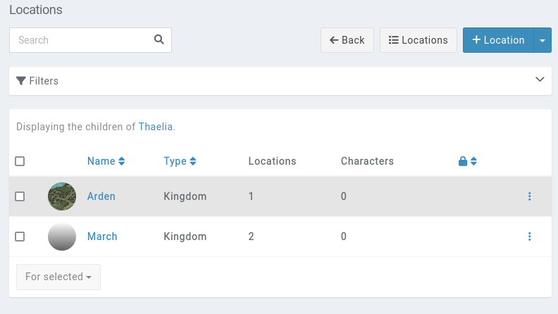
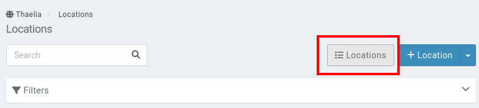
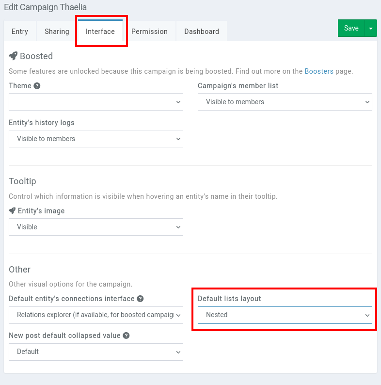

# Nested entities

Most entity types in Kanka have the concept of a **parent**. This is a [foreign field](/entities/foreign-field) that defines a similar entity (aka same entity type) as its parent.

For example, if you're creating a [location](/entities/locations) for Paris, the parent might be France. Setting parents can be a way to build your world in a zoom-in/zoom-out mode, but can also be used to organise your world's content. For example, [items](/entities/items) also have a parent field. This can be used to group all potions together.

## Nested view

Entities that have a parent also get a **nested view**. When viewing the list of locations of a campaign (by clicking on **Locations** in the [sidebar](/features/campaign/sidebar)), by default it shows all locations that have **no parent**. A location with sub locations will appear in a bold style, and can be clicked to view the child locations.

You can still view all your locations in a flat mode by clicking on the **Locations** button in the top-right of the locations.

### Changing defaults

If you prefer to view entities in a flat mode (all entities listed by default), you can do so by editing the campaign and changing the **Default lists layout** field under the **Interface tab**

