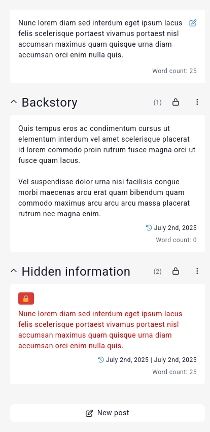
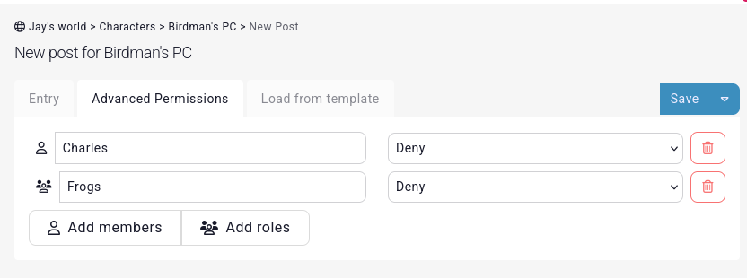
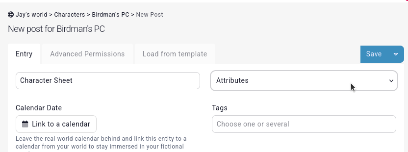
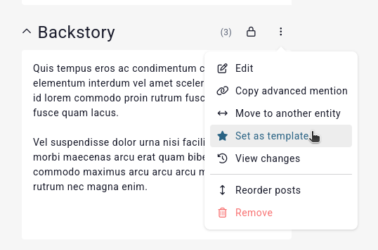
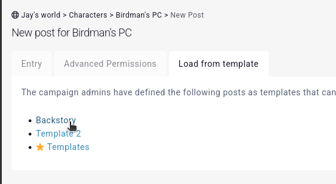

# Posts

Every entity has a single entry field, but can have many posts. Posts are, fundamentally, just more entry fields for an entity.

Posts have a name, for example, you might want to add a **Backstory** post to a character. They can also have a location, for example if the backstory was in the town they grew up in.

## Permissions

Players who can edit an entity automatically get to edit their posts. If you don't want to allow your players from editing an entity, but still add posts (for example their notes/clues about an NPC), you can give their role permission to edit the posts of the entity in the [permissions](/features/permissions) subpage of the entity.

## Hidden information

Posts can also be made invisible to other players by using the [visibility option](/advanced/visibility), or using the **advanced permissions** tab when creating or editing a post. For example, you can deny a post being visible to an individual member or role.

## Special layouts

When creating a new post, [Premium campaigns](https://kanka.io/premium) can set the post to display a subpage or special content instead of text. For example, you might want the character's sheet/attributes to be visible directly on the overview.

## Templates

If you're often recreating the same post on multiple entities, you can set posts as templates.

Then, when creating a new post, you can load from your templates.

