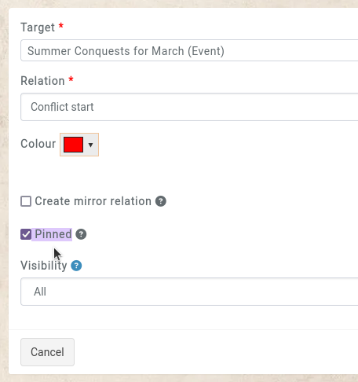
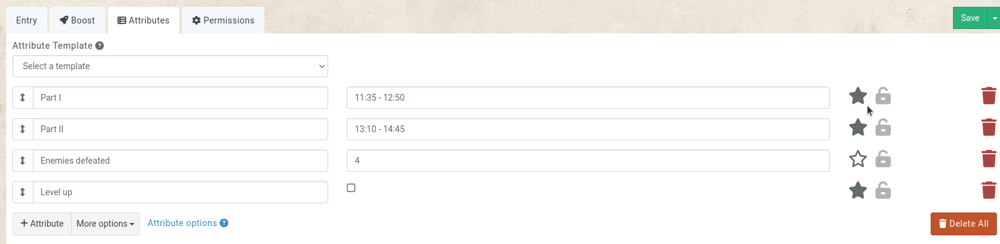
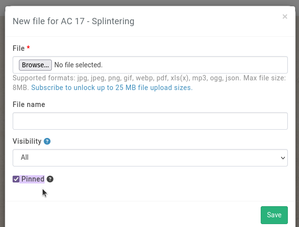
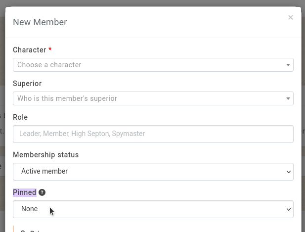

# Pinning

Pinning elements to the sidebar is configured when creating or editing elements that can be pinned.

## Pinning Relations

When creating or editing a relation, the `pinned` option can be activated.

## Pinning Properties

When editing all the properties of an entry (either in the entry's `properties` tab or from the `manage` button in the `properties subpage`), clicking on the `star` icon on the right will pin the property.

## Pinning Files

When creating or editing a file (under the entry's `assets` subpage), the `pinned` option can be activated.

## Pinning organisation members

When creating or editing a member of an organisation, the option to pin that member is available. The options include pinning the membership on the character, the organisation, or both.

