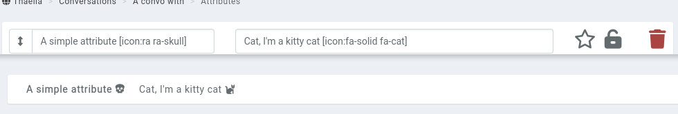

# Properties

Properties are little bits of information attached to an entry. The most obvious example is a [character's](/entries/characters) **HP**, or a [location's](/entries/locations) **population**.

## Property types

Properties are split off into multiple types. The most basic one is simply a text block of up to 191 characters, containing (mostly) whatever you desire.

The types and their usage are as follow:

* **Text**: 191 character, anything goes property.
* **Checkbox**: A checkbox. If selected, appears as a _checkmark_ in the entry's properties, and nothing when empty.
* **Multiline**: For if you want to write about the entry's favourite recipe in properties, you can.
* **Numbers**: Limit the content of the property to a numerical value.
* **Section**: After a while, an entry with lots of properties can get visually messy. Use sections to split off properties into their own "boxes".
* **Random**: Only available in [property set](/entries/property-kits).

## Syntax

You can reference entries in properties using the advanced mention syntax `[entity:id]` or typing `@abc` in the property value field. You can also reference other properties by using the `{Level}` syntax.

You can get creative with some [basic math](https://github.com/chriskonnertz/string-calc) options. For example, an property with the value of `{Level}*{Con}` will multiple the `Level` and `Con` properties of this entry. If you want to round up or down, you can use `floor({Level}/3)` or `ceil(({Con}*{Level})/2)` as well.

Number properties can be set up to only allow values between a range of numbers. For example, use `Level[range:1,10]` to limit the property between 1 and 10. The range values can also reference other properties, for example with `HP[range:0,{MaxHP}]`. When saving a property, if the value is outside the range, it will automatically revert to the closest range value.

The same syntax can also be used in a standard property to create a dropdown of preset options when live-editing a property in a [character sheet](/plugins/character-sheets) or in the entry's properties page, for example with `[range:London,Berlin,Zürich]`. However, the full properties form will still show them as text fields and accept any value.

When creating or editing an [property set](/entries/property-kits), you can set random properties. This can either be a random value between two numbers separated by `-`, or a random value from a list of values separated by `,`. The value for the property is determined when the set is applied to an entry, or when an entry is saved.

For example, if you want a number between 1 and 100, use `1-100`. If you want a value from a list of options, use `London, Berlin, Rome, Zürich`.

You can reference the entry's name in a property value with `{name}`. If a property exists with that name, the property will be used instead.

Icons from FontAwesome and RPGAwesome can be rendered for example with the `[icon:fa-solid fa-user]` or `[icon:ra ra-aura]` syntax, both in the property name and property values. Note that mentioning a property that contains an icon in its name doesn't always work and will randomly break. 

## Privacy

A property can be kept private from your players, for example the BBEG's weakness to fire, by clicking on the **lock** icon. When enabled, only members of the campaign's admin role will see the property.

## Pinned properties

Properties can also be pinned to the [entity's profile sidebar](/features/profile-sidebar) using the **star** icon.

## Property sets

When creating or editing an entry, the top of the **properties** tab contains an option to select an [property set](/entries/property-kits). Doing so will add properties from that set when the entry is being saved. If a property exists on the entry and the set, only the property from the entry is saved.

If you want to apply a set to multiple entries at a time, look at the [bulk options](/guides/bulk).
