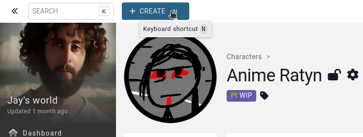
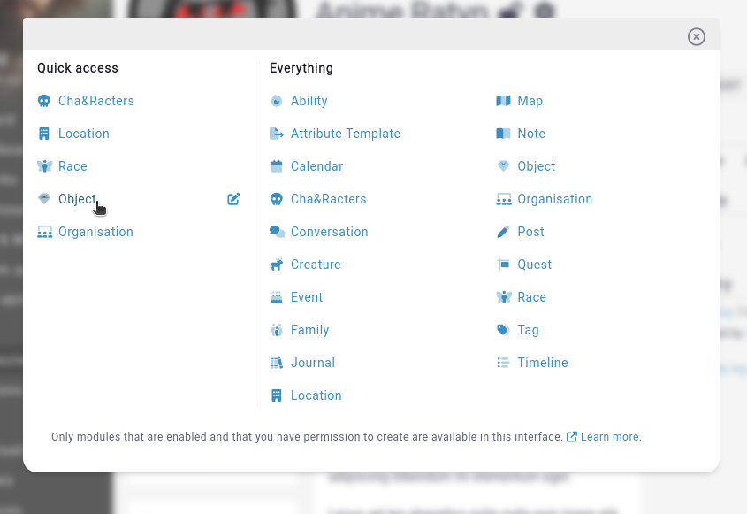
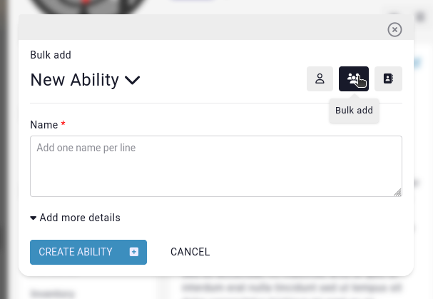
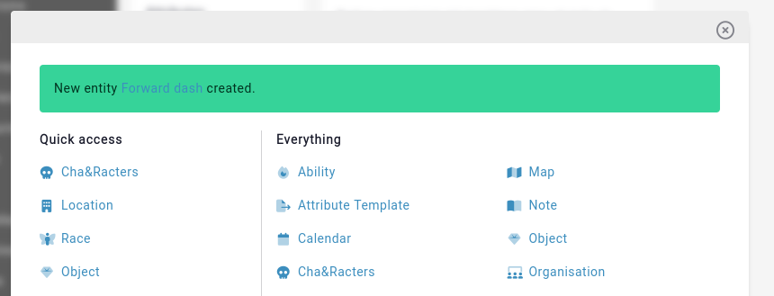

# Quick Creator

Whenever you are creating a new entry, say for example a new character, you probably won't be creating it in a vacuum. The character might have a family, a tag, or a location that you haven't yet created. Rather than having to open a new tab and go and create the related elements, you can use the "create" button situated at the top left of every page.

> The quick creator can also be opened by pressing the "N" (for "new") key.

This button opens our "quick creator" interface, and allows you to create a plethora of new entries without ever having to leave the current page you are on.

## Available entries

While an admin has access to all the core categories that aren't disabled in the campaign, your players only get access to categories their role can create. Module names are listed alphabetically based on the [custom names](/features/campaigns/categories) given to them.

Creating a new article is only available to campaign admins, and can be added to any entry of the campaign. These articles can have a simple text, a visibility, and a position of either first or last article.

## Multiple at a time

To create multiple entries of the same type at a time, you can click on the **bulk add** icon to the top right. Each line is processed as an entry name.

Any empty line will be discarded.

Once your entry is created, the quick creator shows a link to each newly created entry, and you can continue creating more entries.

