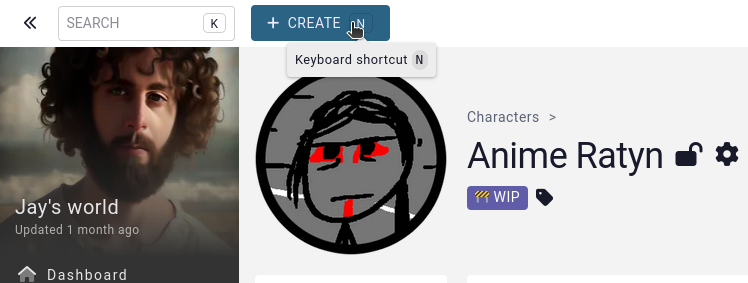
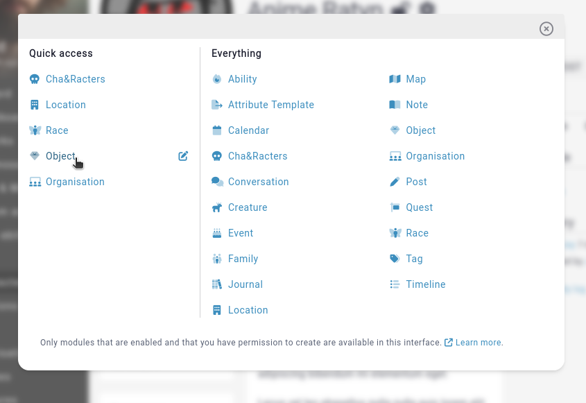
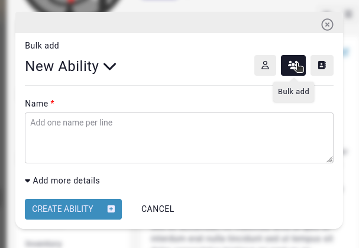
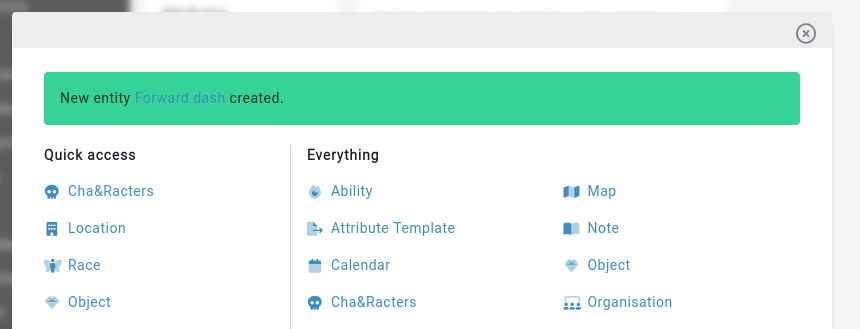

# Quick Creator

Whenever you are creating a new entity, say for example a new character, you probably won't be creating it in a vacuum. The character might have a family, a tag, or a location that you haven't yet created. Rather than having to open a new tab and go and create the related elements, you can use the "create" button situated at the top left of every page.

> The quick creator can also be opened by pressing the "N" (for "new") key.

This button opens our "quick creator" interface, and allows you to create a plethora of new entities without ever having to leave the current page you are on.

## Available entities

While an admin has access to all the core entity types that aren't disabled in the campaign, your players only get access to entity types their role can create. Module names are listed alphabetically based on the [custom names](/features/campaigns/modules) given to them.

Creating a new post is only available to campaign admins, and can be added to any entity of the campaign. These posts can have a simple text, a visibility, and a position of either first or last post.

## Multiple at a time

To create multiple entities of the same type at a time, you can click on the **bulk add** icon to the top right. Each line is processed as an entity name.

Any empty line will be discarded.

Once your entity is created, the quick creator shows a link to each newly created entity, and you can continue creating more entities.

