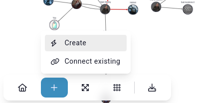
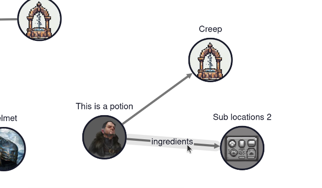
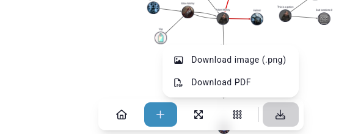

# Relations

To view all of the world's relations, click on the *Relations* (or *Connections*) menu in the sidebar. From here, you can create new relations and view and edit existing ones. You can perform bulk actions here as well.

## Web

If you want to visually view a web of all of your world's relations, click on the **View web** button at the top of the Relations page.

From this interface, you can also create new relations and view and edit existing ones. Clicking on an entry previews it without having to leave the page.

To add a new relation or create a new entry, click on the **+** (plus) button.

To edit a relation, click on the line between two entries.

### Exports

You can export the web as a PNG or PDF file by clicking on the Download button.

