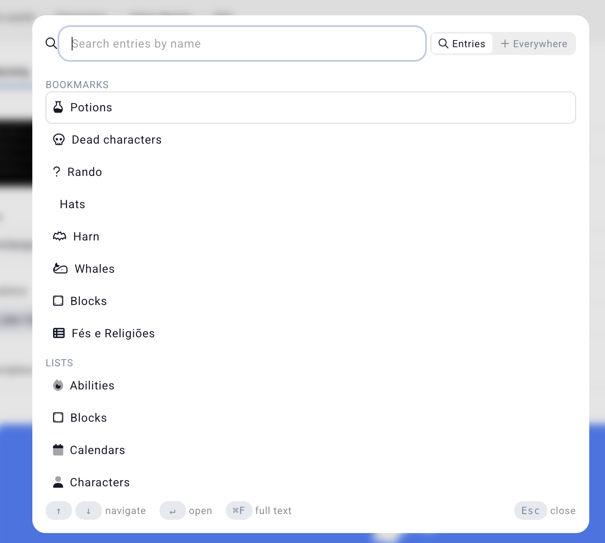

# Search

The search field at the top of every page (accessible by clicking `Ctrl+K`) will allow you to search for entries in the campaign based on their names, or do a full-text search.

By default, it opens with no results, but shows the campaign [bookmarks] and lists.

Type in the search field to find for entries with that name. 

## Full text

You can enable full-text search by clicking on "everywhere" on the top-right of the dialog. Read more about 
[full-text search](/advanced/fulltext-search).

## Related

[Filtering the search](/advanced/filteres)
