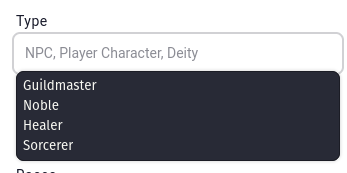

# Suggestions

Various text fields that aren't linked to entities will use display suggestions to re-use the same value. For example the `Type` field on entities, when focused, will display up to **20** (twenty) recently used types on the same entity type. This means that when you create a character, the type field contains up to 20 recently used types on characters in the campaign.

## Limitation

This dropdown is rendered by the browser, meaning each browser (and especially mobile browsers) might handle the suggestions slightly differently.

## Caching

This list isn't recalculated on every page load to save up resources, and is cached on Kanka's servers. This can mean that, in certain situations, the first suggestion isn't the latest used type.