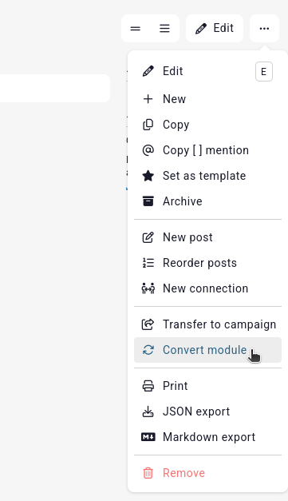

# Convert categories

Since entries all share a similar base, this means you can change an entry's category after they've been created. Say you create an [event](/entries/events), fill it out, and later realise you want an [item](/entries/items) instead. No worries, you can change the entry's category in its **action menu**, accessed by clicking on the button to the right.

## Data gained, data lost

This convert will keep all the shared data the two categories. For example, if you convert an event to an item, the item has no _date_ field, so that is lost. Converting the item back to an event will not recover the _date_ value.

However, the name, type, entry, tags, permissions, properties, articles, reminders, relations, abilities, and all shared features accross categories are kept. You also don't need to update any **mentions** targeting the original event, Kanka automatically keeps track and updates all of them!

## Converting multiple entries

It is possible to convert multiple entries at a time, rather than converting each one individually. This is explained in our [bulk documentation](/guides/bulk).