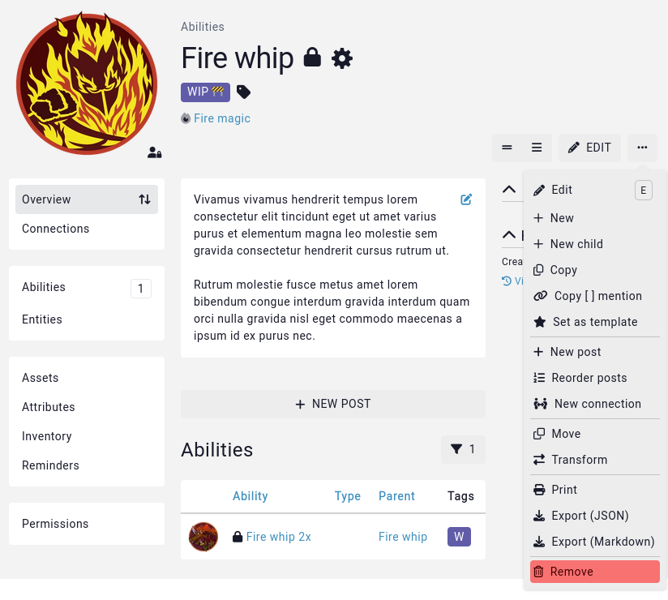

# Deleting entries

There are several ways to delete entries from your world, for when your players (or if we're being honest here, it was probably you) created a or multiple duplicates of an NPC or location.

## Deleting a single entry

To delete a single entry, go to that entry, click on the `...` button to the right to open the **action menu**. The last option will always be to delete the entry (if you have the right [permissions](/guides/testing-permissions)).

## Deleting multiple entries

To delete multiple entries at a time, use the [bulk](/guides/bulk#remove) option.

## Recovering deleted entries

Accidently deleted something you shouldn't have? Learn about [recovering deleted entries](/features/campaigns/recovery).

