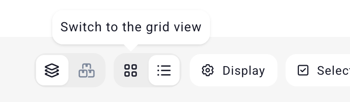
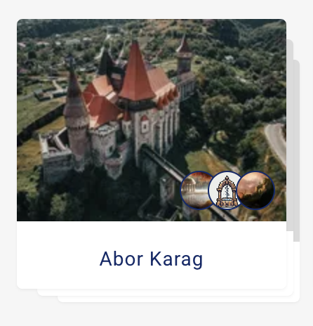

# Entry Lists

When looking at all the characters, locations, or other module of the campaign, we call this an "category list". For example, a "character list".

## List modes
By default, entries are shown in a **grid** view with a focus on visuals.

This is in contrast with the **table** view, which isn't visually pleasing but has more information (which can be toggled on/off).

### Switching modes

When viewing a list, of a different view mode is possible, a button will appear on the top right.

###  How to set the default

When switching from one mode to another, Kanka will automatically remember the last mode you selected [per category](/features/campaigns/categories), so you can keep your characters in grid view, but have your quests in table view. This feature only works if you are logged in to your Kanka account.

## Stacking / Nested

Both modes have a "Nested" and a "Flat" layout. When in "Nested" mode, clicking on the image or > icon will load the children of the entry, while clicking on its name will go to that entry.

## Filters

Filters (accessed by clicking the **filters** button) are remembered by category for your account on the current campaign.
