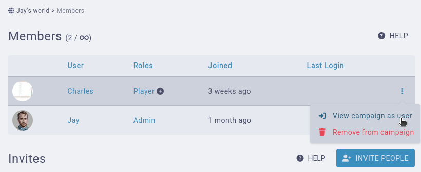
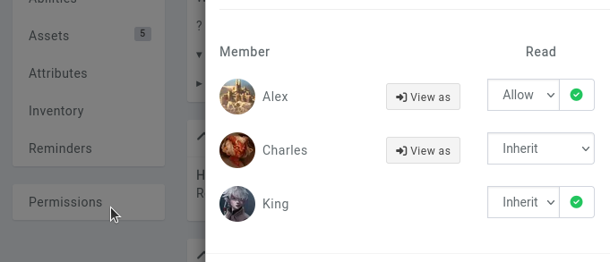
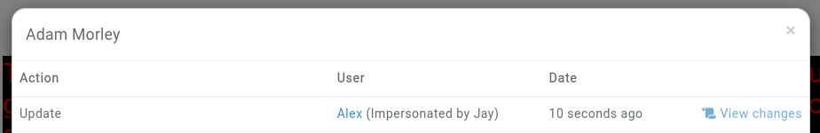
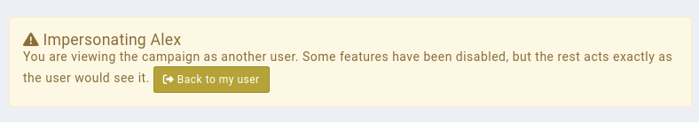
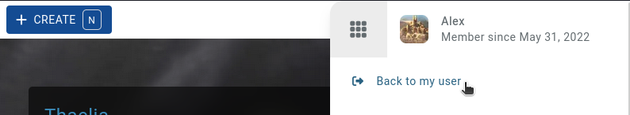

# Testing permissions

Part of setting up your Kanka campaign is setting up the correct Permissions. It is easily to check what your players can see without having to create a second account or asking for your players' passwords.

## Campaign Setup

To check your campaign permissions, you'll first need another member in your campaign that isn't part of the campaign's admin role. As a campaign admin, you can view your campaign as one of your non-admin members.

## Switching to another user

To view your campaign as another member of your campaign, click on `Settings` in the sidebar and then on the `Members` subpage.

In this interface, you'll see the members of your campaign. On the right, members who aren't part of the campaign's admin role will have a button. This reveals the View campaign as member option. Clicking on it will redirect you to the campaign's dashboard as the user. From there on, you can explore the campaign, viewing it as the user would.

You can also switch to a member directly from an entity's **permissions** subpage and clicking on the **View as** button.

## Logs

Making changes on entities while viewing the campaign as the member will log the changes on the entity with the information that you are doing it.

Also to note is that you won't see elements set up with the "self" visibility while viewing the campaign as the user, to avoid admins accessing content not designed for their eyes.

## Switching back

Once you're done confirming the permissions, you can click on the Back to my user button at the top of every page.

You can also access this feature from the profile menu at the top right.

