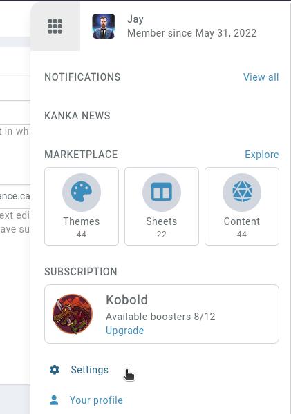

# Appearance settings

Your profile settings can impact the visuals and workflows of your Kanka experience. You can change these [here](https://kanka.io/en-US/settings/appearance), or when in Kanka, by clicking on your profile picture and on **settings**, then going to **appearance** in the sidebar.



## Theme

This field controls how campaigns, your settings, your billing section and other parts of Kanka are rendered. The **default** theme is a bright theme, while **dark** and **midnight blue** offer an experience for those preferring a dark mode.

Note that campaigns have the option to override your theme setting, forcing a campaign to be displayed in the owner's preferred theme.

## Results per page

If you want more than 15 characters shown in the characters list, you can change this value here. [Subscribers](https://kanka.io/en-US/pricing) get access to up to **100** entities per page.

## Date formatting

Date formatting is a cultural preference, so we try and support the most frequent ones. This format is only used for real dates like for invoices, quest and journal "real dates", but don't impact the day calendar dates are displayed.

## Campaign order

If you are a member of multiple campaigns, this setting allows you to control in which order those campaigns are displayed. This controls both your campaigns and your followed campaigns, but keeps them into two separate lists.

## New entity workflow

When creating a new entity, by default, Kanka redirects you to the list of entities of that type. You can change this to show the newly created entity instead to avoid some extra clicks.

## Text editor

Kanka has two text editors, but we highly discourage using the legacy one. Some features like advanced mentions and the [campaign gallery](campaigns/gallery) don't work in it. Its only advantage is that it has a more powerful table editor.

```{admonition} Limited availability
Switching to the old text editor is only available for users whoes account was created earlier than January 2023.
```

## Nested lists layout

Some modules like locations, notes, families and others have a **parent** field, meaning they can be nested into trees. For example, when browsing the campaign's locations, you can set if you see all locations (**flat**) or if locations are **nested** into their parents first. 

## Mentions

When writing text, typing `@` will inject a mention to a selected entity by simply displaying the target entity's name. If instead you always wish to use the advanced mention `[entity:123]` syntax, activate this option. Read more info about [mentions](/features/mentions).