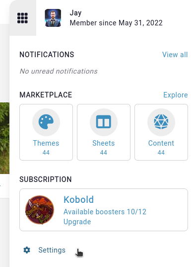
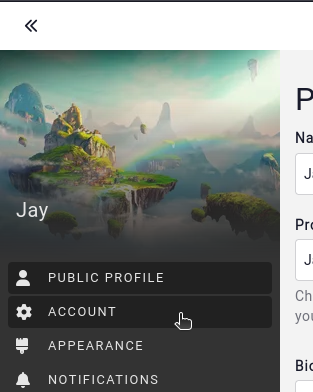
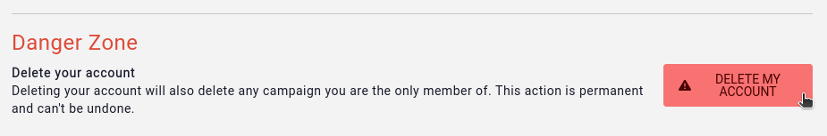
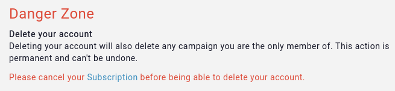

# Delete your account

Your account can be delete from your [account page](https://app.kanka.io/settings/account).

To delete your account, navigate first to your profile settings page



Followed by going to your account page.



Type in your account password if you have one (accounts using social media logins don't)

On your account page, scroll down to the "danger zone", where you can delete your account.



```{admonition} Data retention
Deleting your account immediately removes all of your data and campaigns you are the only member of from our systems.
```

## Active subscription

If you have an active [subscription](https://kanka.io/pricing), you'll have to cancel that first before being able to delete your account. As soon as your subscription is cancelled, even if it's still ongoing, you can delete your account.

