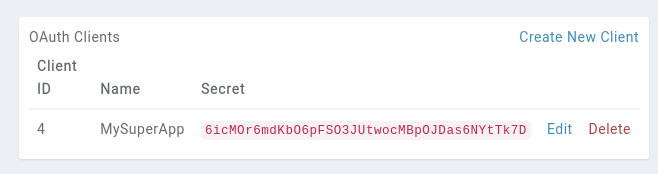

# API OAuth Client

If you are building an app that interacts with the Kanka API for many users, it is simpler to generate an OAuth client within Kanka.


```{info} Warning
Kanka's OAuth Clients are built with the [Laravel Passport](https://laravel.com/docs/9.x/passport) plugin. A lot more information and details can be gathered from the plugin's docs.
```

## Generating an OAuth Client

To generate an OAuth client, visit your [API settings](https://kanka.io/en-US/settings/api?clients=1). This allows you to create a new client with a name and a callback URL.

* **Name**: The name of your application. Users will be shown this application name in the permission grant screen.
* **Callback URL**: This is the URL that users will be redirected to when approving or cancelling your app's access to their account.

Once a client is created, it will show up in the list with a `Client ID` and `Secret`. This will be important later.



## Requesting access

To request access from a user, the user needs to call the `oauth/authorize` page. An example request looks like this.

```php
    $query = http_build_query([
        'client_id' => 'client-id',
        'redirect_uri' => 'http://my-super-app.com/callback',
        'response_type' => 'code',
    ]);
 
    return redirect('https://kanka.io/oauth/authorize?'.$query);
```

If the request is properly formated, the user should be greeted by a page asking them to authorize or deny your app's access to their account.


When the user clicks on `Authorize`, they will be redirected to your app's URL with a `code` parameter in the URL.

## Converting Authorization Codes To Access Tokens

If the user approves the authorization request, they will be redirected back to the consuming application. The consumer should issue a `POST` request to Kanka's `/oauth/token` to request an access token. The request should include the authorization code that was issued by Kanka application when the user approved the authorization request.

```php
$response = Http::asForm()->post('https://kanka.io/oauth/token', [
    'grant_type' => 'authorization_code',
    'client_id' => 'client-id',
    'client_secret' => 'client-secret',
    'redirect_uri' => 'http://my-super-app.com/callback',
    'code' => $request->code,
]);
```
If successful, this will generate a token that you can then use to authenticate the user on the Kanka API.

```json
{
  "token_type":"Bearer",
  "expires_in":31536000,
  "access_token":"xxxxxx",
  "refresh_token":"yyyy"}
```

## Refreshing a token

By default, tokens are valid for 1 year. These can be renewed by making a `POST` request to the `oauth/token` endpoint.

```php
use Illuminate\Support\Facades\Http;

$response = Http::asForm()->post('https://kanka.io/oauth/token', [
    'grant_type' => 'refresh_token',
    'refresh_token' => 'the-refresh-token',
    'client_id' => 'client-id',
    'client_secret' => 'client-secret',
    'scope' => '',
]);

return $response->json();
```