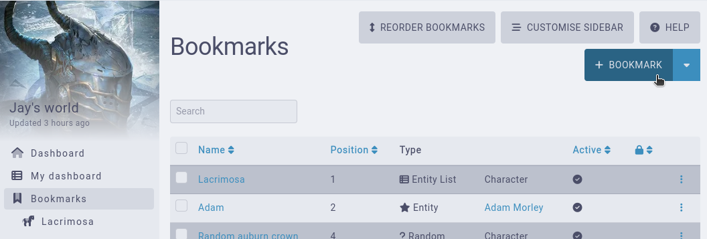
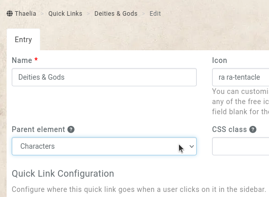
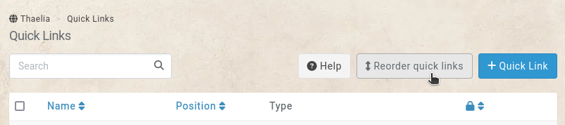

# Bookmarks

Campaigns can have bookmarks, which are displayed in the campaign's sidebar..

By default, campaigns are limited to **3** bookmarks, with [premium campaigns](https://kanka.io/premium) having unlimited bookmarks.

## Creating a bookmarks

To create a bookmarks, start by going to **bookmarks** and click on the **+ bookmarks** button on the top right.

There are currently four different types of bookmarks. Ones that point to a specific entity, ones that point to a list of entities, ones that point to a random entity, and ones that point to a dashboard.

### Entity

This bookmark points to a specific entity. Select an existing entity from the list, and an optional subpage the link should point to (for example an entity's attributes).

Note that if the entity can't be seen by a user, the link won't appear in the bookmarks.

### Entity list

This bookmark points to a list of entities, for example a list of characters. You can combine this with [filters](/advanced/filters), to for example only show characters who are dead, or who have a specific tag.

The nested field controls if the link forces the page's nested more. This is only useful for entities which have a parent (ie locations).

#### Example: A link to your world's deities

For example, if you want to have a bookmark going to your [characters](/entities/characters) that are part of the campaign's **deity** race, follow these steps.

1. Go to your characters, and filter them to your deity race.
2. On the characters list showing just your deities, expand the filters section and click the **copy to clipboard** button.
3. Create a bookmark of the **entity list** type, set the **entity list** to **characters**, and _paste_ in the **filters**.
4. Save the bookmark and enjoy a link to your deities!

### Random

To replicate a wiki's random page link, use this option to open a random entity of the campaign each time the link is clicked. You can limit the kind of entity selected, and also include filters. For example, if you have a To-Do tag in your campaign, you can open a random entity that you've marked as needing more work.

### Dashboard

On [premium campaigns](https://kanka.io/premium), you can point the bookmarkto a specific [dashboard](/guides/campaigns) of the campaign.

### Placing a bookmark

By default, bookmarks will appear in their order in the `Bookmarks` section of the sidebar. However, premium campaigns have access to a `Parent Element` option, which allows bookmarks to appear directly after another element of the sidebar. 

From our earlier example of your deities, setting the `Parent Element` to **Characters**, the bookmark will appear below the **Characters** menu element.

### Reordering bookmark

Bookmarks that are displayed in their bookmarks section of the sidebar can be reordered. When viewing the list of bookmarks of the campaign, the top-right contains a `Reorder` button.

