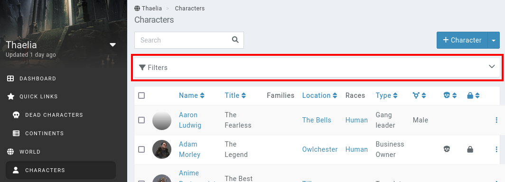
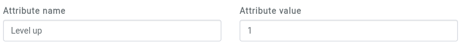
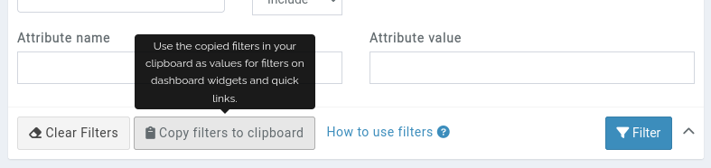

# Filters

As your campaign becomes larger and content no longer fits on a single page, for example for the world's characters, filters become an essential tool for finding the info you are searching for.

Every main list of entities accessibly from the [sidebar](/features/campaigns/sidebar) can be filtered. To open the filters, click on the **Filters** box above the list of entities.



This opens up tons of filter options.

```{admonition} Additive filters
Filters are aditive, which means that when providing a `type` and a `location` filter, only entities that match both criteria are displayed.
```

## Text matching

Text fields support various options to control in further detail what is filtered out.

* **!...**: By placing an `!` before your text, you can search for anything that doesn't contain the text in the field.
* **...!**: By placing an `!` at the end of your text, you can search for every entity with exactly this text in the field.
* **!!**: Writing `!!` in a field will search for all entities where this field is empty.

You can combine search options on text fields by writing `;`. For example `Alex;!Smith`.

Filters and ordered columns set for an entity list are saved into your session, so as long as you stay connected you don't need to re-set them on every page.

## Family, Location, Race, Organisation

You can filter entities based on their family, location, race and organisation. These search fields look for entities that have an exact match with that name. You can use the selection box at the right of the field to select between 4 different behaviours for the filter, these are: 
* **Include**: Includes all entities that are part of the entity choosen.
* **Exclude**: Excludes all entities that are part of the entity choosen.
* **With children**: Includes all entities that are part of the entity choosen and all of its children.
* **None**: Shows all entities that aren't a member of any entity of the choosen type.

## Attribute name

You can filter entities based on their attributes. The search fields are exact matches for both the name and value. You can also search for entities that have a specific attribute whose value is not empty by typing `!` on the value field. When the value field is left empty, it looks for entities that have an attribute with that exact name. You can type `!Level` to exclude entities with an attribute called Level.

The filter doesn't evaluate attribute calculations. If an attribute has a value of `{HP} * {Level}`, searching for the result of that calculation isn't possible.

### Checkbox filters

To filter on attributes which are of the **checkbox** type, use the following values:

* **0** in the value field for unchecked attributes
* **1** in the value field for checked attributes



## Copy filters to clipboard

After filling out the filters and clicking the **Filter** button, the list of entities will be updated. At this point, in the filters box, the **Copy filters to clipboard** button becomes active. Clicking it copies the filters to the clipboard, which can be pasted in the dashboard [widget filters](/guides/dashboard#widget-filters) and [bookmark](/advanced/bookmark) **filters** fields.




