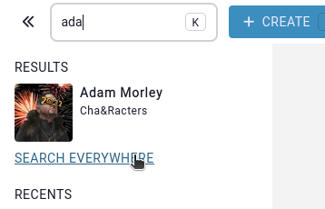
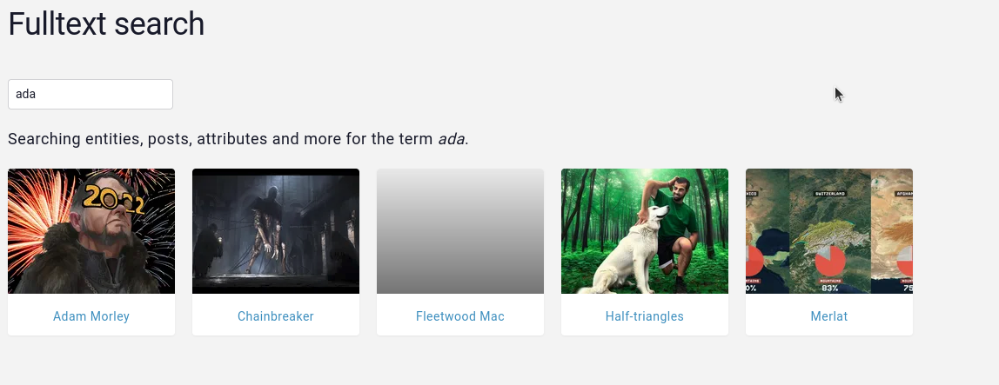

# Full-text search

In the case that you want to do a full-text search on all the contents of all entities, (i.e. attributes, posts, entries) you can click on the "search everywhere" button displayed below the [quick search](/features/search).

This will perform the search for the same query, but now on all the contents of the campaign, the results of the search will always be entities, for example, if the match occurs on an timeline element's name, the displayed result will be the entity that has that timeline element.

# Number of results

Search results are limited to 100 entities, this means that only the first 100 closest matches to the query will be processed. However, these results can sometimes make reference to the same entity, for example, if an entity's name and the title of one of its posts are a perfect match for the query, these would count as 2 results, but the entity would only be display once.

Search results are displayed in alphabetical order and not relevancy due to limitations of the search engine. However, the results displayed are the top 100 most relevant results for the query.

# Related

* [Quick search](/features/search)
