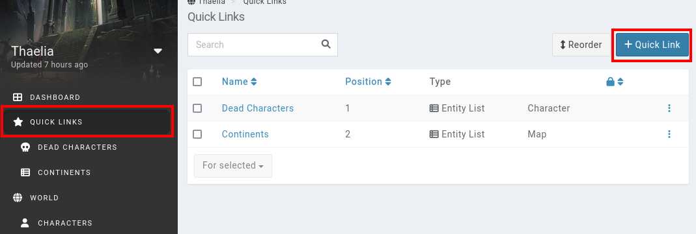

# Quick Links

Campaigns can have quick links, which are basically favourite pages in the campaign.

By default, campaigns are limited to **3** quick links, with [boosted campaigns](https://kanka.io/en-US/boosters) having unlimited quick links.

## Creating a quick link

To create a quick link, start by going to **Quick links** and click on the **+ Quick Link** button on the top right.

There are currently four different types of quick links. Ones that point to a specific entity, ones that point to a list of entities, ones that point to a random entity, and ones that point to a dashboard.

### Entity

This quick link points to a specific entity. Select an existing entity from the list, and an optional subpage the link should point to (for example an entity's attributes).

Note that if the entity can't be seen by a user, the link won't appear in the quick links.

### Entity list

This quick link points to a list of entities, for example a list of characters. You can combine this with [filters](/advanced/filters), to for example only show characters who are dead, or who have a specific tag.

The nested field controls if the link forces the page's nested more. This is only useful for entities which have a parent (ie locations).

#### Deities

For example, if you want to have a quick links going to your [characters](/entities/characters) that are part of the campaign's **deity** race, follow these steps.

1. Go to your characters, and filter them to your deity race.
2. On the characters list showing just your deities, expand the filters section and click the **copy to clipboard** button.
3. Create a quick link of the **entity list** type, set the **entity list** to **characters**, and _paste_ in the **filters**.
4. Save the quick link and enjoy a link to your deities!

### Random

To replicate a wiki's random page link, use this option to open a random entity of the campaign each time the link is clicked. You can limit the kind of entity selected, and also include filters. For example, if you have a To-Do tag in your campaign, you can open a random entity that you've marked as needing more work.

### Dashboard

If the [campaign is boosted](https://kanka.io/en-US/boosters), you can point the quick link to a specific [dashboard](/guides/campaigns) of the campaign.
