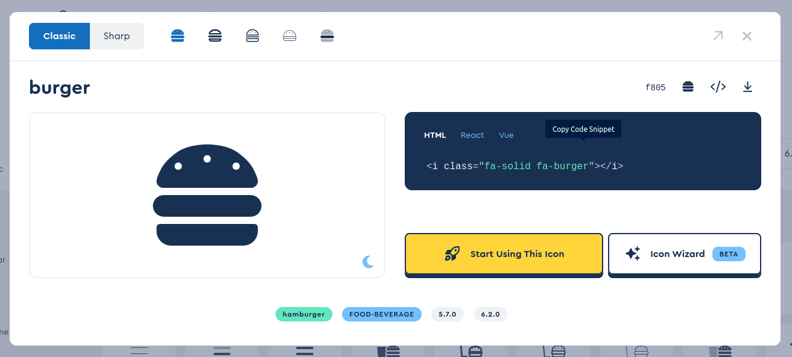
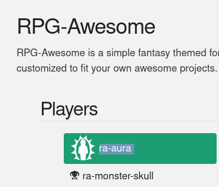

# Available icons

Various elements in Kanka have an `Icon` field. This can be filled out with an icon from [FontAwesome](https://fontawesome.com/search) or [RPGAwesome](https://nagoshiashumari.github.io/Rpg-Awesome/), and will display the desired icon in the interface.

### Using FontAwesome

To use a FontAwesome icon, click on the desired icon and click on the HTML **Copy code snippet**. This copies the icon to your browser.

Next, paste the value in the campaign sidebar **icon** field. The HTML will automatically be transformed to a format supported by Kanka.

### Using RPGAwesome

To use an RPGAwesome icon, copy the desired icon's "name" and paste it in the sidebar **icon** field. You'll also need to append ` ra` (with a space in front) to make it work. For example, `ra-aura ra`.

