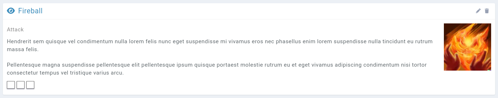
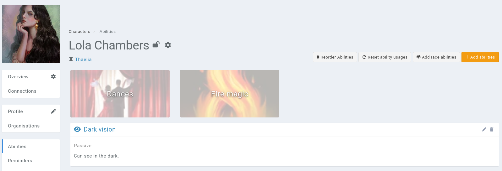
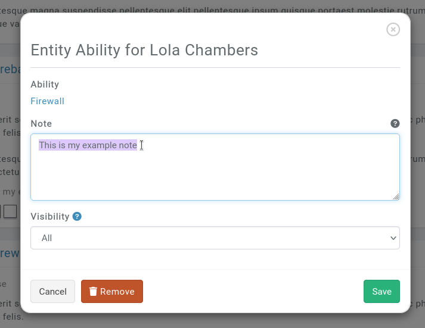
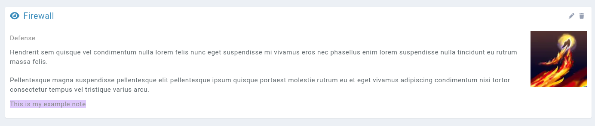

# Abilities

A way to build the **powers** of your characters. Think of this module as a way to represent the magic system of your world.

## Fields

Let's go over the fields that are unique to the abilities' module.

### Charges

The **charges** field can be used to keep track of how many times an ability was used when it's attached to an entity. This field can contain a value, or references to named attributes of an entity.

When an ability with a charge is attached to an entity, it will display a number of squares equal to the total charges. Clicking a charge will automatically flag a charge as used, up to the max charges.

## Entity Abilities

Every other entity type has an **Abilities** subpage, which is used for example to keep track of a character's magic, an organisation's special abilities, a locations' _lair actions_, a family's curse, etc.

Each ability added to an entity is grouped by their **parent ability**, and abilities with no parent ability are displayed in an **Uncategorized** section at the end.

Consider the following nested ability structure:

* **Fire magic**
  * Fireball
  * Firewall
* **Dances**
  * Salsa
  * Flamingo
* Dark vision

Adding Fireball, Firewall, Salsa, Flamingo and Dark Vision will render the following entity abilities.

Note that parent abilities are ordered alphabetically and can't be reordered.

### Actions

#### Add race abilities

The **Add race abilities** will import abilities attached to the entity's [races](/entities/races).

#### Reset charges

Clicking this button resets the charges used of each entity ability back to zero.

#### Reorder abilities

This interface allows you to reorder the abilities inside their parent abilities.

### Fields

Each entity ability can be edited, and this interface allows a user to write a note, that is displayed in the UI.

### Mentioning attributes from the current entity

You can have the ability's entry be something like

> Does {dice}d6 damage

When rendering on the abilities subpage, Kanka will replace {dice} with the value of an attribute on the entity named `{dice}`.
