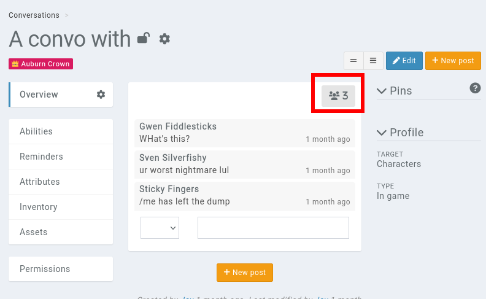

# Conversations

A **deprecated** conversation is available in Kanka. By default, it is disabled in campaigns, and can be [enabled](features/campaigns/modules).

Doing so enables the **conversations** module in the campaign, available in the [campaign sidebar](features/sidebar).

## Types of conversations

Conversations are split between two types of participants.

* **Members**: Choose this option if you want members of the campaign to be able to write in the conversation.
* **Entities**: Choose this option if you want the conversation to be between entities of the campaign, like characters.

## Adding members

Once the conversation is created, you can add members to it by clicking on the "user" icon on the top-right.




```{admonition} Permissions
Adding members of the campaign still requires them to have the adequate permissions to view the conversation.
```
