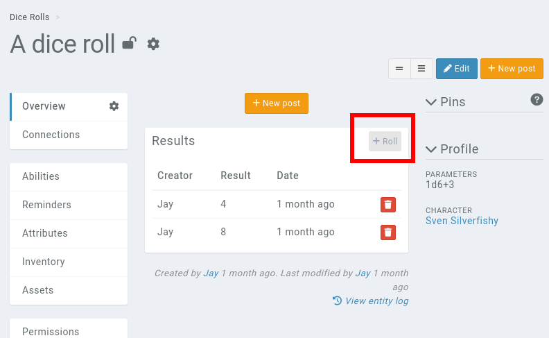

# Dice Rolls

A **deprecated** dice module is available in Kanka. By default, it is disabled in campaigns, and can be [enabled](features/campaigns/modules).

Doing so enables the **dice roll* module in the campaign, available in the [campaign sidebar](features/sidebar).

## Creating a dice roll template

Dice rolls are templates, attached from an entity, and contain a dice roll value.

Generic dice rolling is possible by writting "d20", "4d4+4", "d%" for percentile and "df" for fudge.

It is also possible to get a character's attribute by using the `{character.attribute_name}` syntax. For example, `{character.level}d6+{character.wisdom}`.

More options are available and explained on the [dice roller plugin page](https://github.com/ringmaster/dicecalc#Dice).

## Rolling a dice

To make a dice roll, view the dice roll and click on the *roll* button at the top right.

