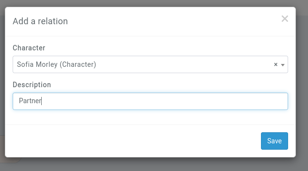

# Family Trees

```{admonition} New feature
This article is for a recently added feature to Kanka!
```

[Families](/entities/families) can have their family trees created in Kanka. This feature is only available to [premium campaigns](https://kanka.io/premium). To start creating a family tree, go to a family and go to their *family tree* subpage.


From there, click on *edit*, and click on **add a founder** button. 

## Founder

A family tree starts by a founder, which will be the first element of the tree. No character can be added before or above the founder. A founder can be change at any time.


## Relation

Each entity can have one or multiple relations, which are added by clicking on the **add relation** button. This brings up the form asking which entity to add, and what their relation is.




## Children

Each relation can have multiple children, which are added by clicking on the **add child** button below the relation's description.


## Limitations

As with every new feature, there are currently some limitations.

* Children need exactly two parents.
* Sometimes there is extra spacing between branches.
* Family members are loaded to speed up setting a founder, but a character's relations aren't.
* A user who can edit a family can edit its family tree. If there are character nodes that aren't visible to the user, those private nodes will be deleted when the user saves the tree.