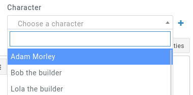

# Foreign Fields

When creating entities, you'll often find dropdown fields that reference other entities of the campaign. These are called **foreign fields**. For example, an [item](/entities/items) has a **character** field, which is its creator.

Every foreign field is used by searching for an entity's name and needs at least 3 characters types. You can filter for an exact search by typing `!Dave`, for example if you have multiple _Dave_s in your campaign but only one called _Dave_.

## Creating a new entity

Sometimes you want to add a foreign field, but haven't created it yet. You can use the [quick creator](/features/quick-creator), or click on the little **+ (plus)** sign next to the field. This option only appears if you have the permission to create an entity of that type.

Clicking on the **+ (plus)** actually calls the quick creator. Fill out the form and click save. The new entity is created in the background, and the foreign field is filled out to the newly created entity.
