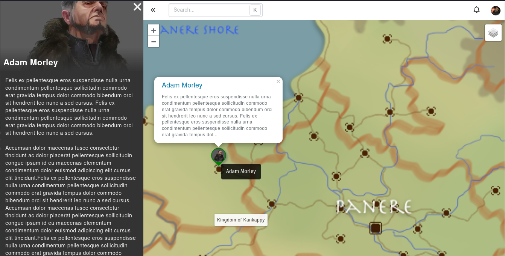
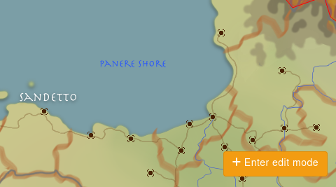

# Map Explore

A map's **explore** page is the best way to consume its content. This shows the map, the layers, groups, and markers.

Clicking on a marker will load its data in the sidebar. This is used from the marker's custom entry field, and from the marker's linked entity.

## Enter Edit Mode

If you can edit the map, a button at the bottom right will show up called **Edit more**. When active, edit mode allows you to click on the map to add a new marker to it.

## Measurement tool
You can enable the measurement tool in the map settings by filling Distance Unit label and Distance measurement.

image.png

## Dashboard widget

A map can be pinned to a dashboard. To do so, add an **entity preview** widget linked to the map to the dashboard. Markers can be clicked on the dashboard, which will open the target entity.