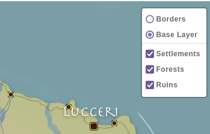

# Map Groups

Map groups are a way to group markers together, where showing or hiding a group on a map will also show or hide all markers in that group.

For example, you can have a group called **Settlements**, one called **Forests** and one called **Ruins**, and place all of your map markers in those groups. When viewing a map, you can toggle the markers in those groups with a simple click.

## Fields

### Permissions

Groups have the standard [visibility](/advanced/visibility) permission system, meaning you can make group only visible to your campaign admins, or only to yourself and hidden from the other admins of your campaign.

## Limitations

Standard campaigns can have a maximum of **one** (1) group per map, while boosted campaigns can have up to **ten** (10).

There is currently no way to have more than ten groups per map.
