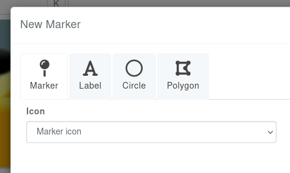
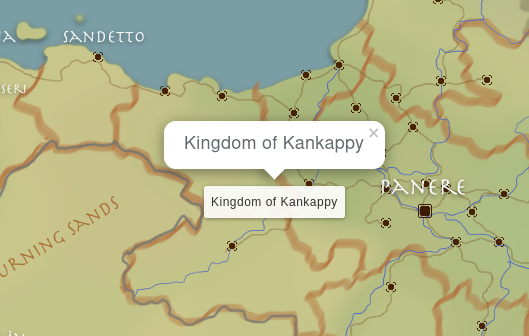
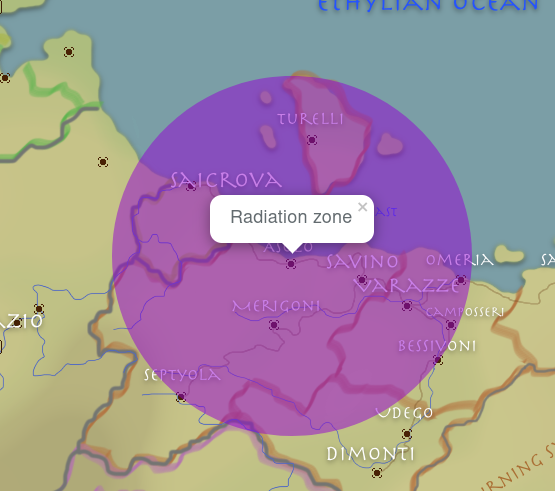
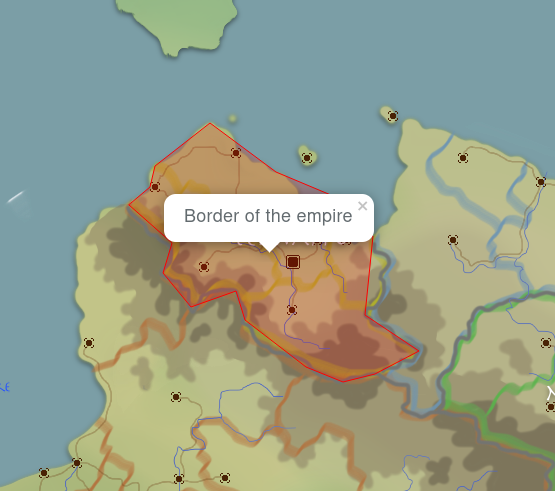

# Map Markers

Markers are the bread and butter of what makes a great map. A nice visual won't tell you much if there is no info on the map!

Markers can be added when editing a map on the **markers** tab, but you'll enjoy your sanity more when adding a marker directly from the **explore** page of a map.

## Types of markers

There are currently four types of markers. Standard campaigns only have access to markers, while boosted campaigns have access to the later three.

### Markers

The basic marker on maps, think of it like a "pin" on a map.

#### Custom Icon

Boosted campaigns have access to **custom icons**, which can be icons from FontAwesome or RPGAwesome. 

For FontAwesome, simply find a font that you like on it, and click on the code snipper (looks something like `<i class="fa-solid fa-user"></i>`), and paste it into the custom icon field. The Snippet will be automatically transformed into a format accepted by Kanka, in this case `fa-solid fa-user`.

In the case of RPGAwesome, copy-paste the icon's name prefixed by `ra ` in the field. For example, for the aura icon, type "ra ra-aura".

This field also supports fully custom SVG icons. You can draw your icons in any vector drawing app and copy-paste the resulting SVG in this field. 

_Note that the SVGs get re-sized by the app to be a default of 32x32 pixels to fit in a marker, so make sure that the SVG's viewport is using a full 100% of the width and height._ 

#### Draggable

These markers have a **draggable** option, meaning users who can edit a map can drag markers on the map's explore page, and their new position will be saved.

### Label

A block of text on the map. This can't be moved around easily, but offers a clear visual different from markers. For example a kingdom's name smack down in the middle of it.

### Circle

Draw a tiny or huge circle on the map. Go crazy! If the available sizes aren't good enough for you, you can give it a custom size in pixels.

### Polygon

The most complicated marker, this option is to draw custom shapes on the map. For best results, create a polygon with `0,0 100,0 0,100` and save it. Once saved, edit the marker to enable clicking on the map to add coordinates. It's a messy process (that we plan on improving soon), but allows fully custom shapes.

The stroke fields are to control the polygon's visuals (border, background color, opacity).

## Overall fields

All markers have some overlapping fields. Here is a brief rundown of some of those fields.

* **Name** vs **Entity**: At least one of these has to be filled out. If both are filled out, the **name** will be used when hovering/viewing the marker.

A marker can have a custom **Entry**, which is its description. When clicking on a marker on the map's explore page, it will display this custom entry, as well as a preview of the marker's linked entity, if one is provided.