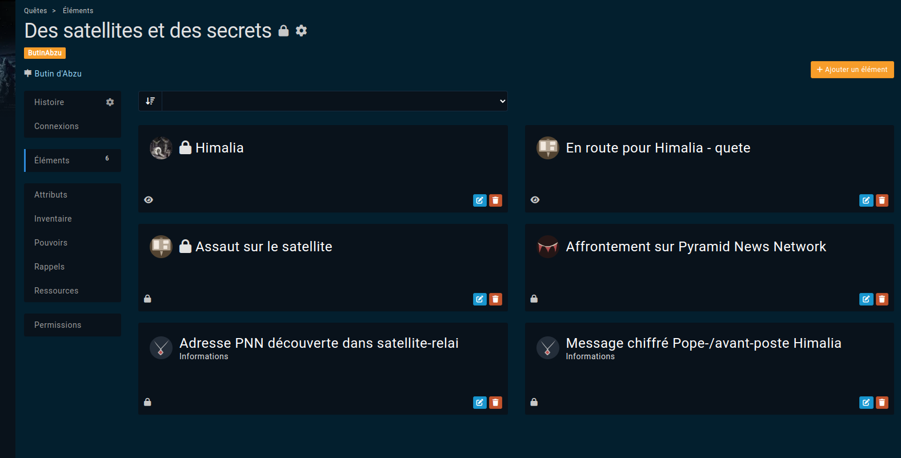

# Quests

Quests are a place to regroup all elements for a part of scenario or a scene.

## Features
Quests specific features are:
* can be nested with "parent quest" field
* a "date" field for reporting which will be displayed in [profile sidebar](/features/profile-sidebar) below pinned attributes
* a "completed" field to keep track of ... completed quest in list view
* calendar date entry: when filled up, it will automatically populate the calendar with a [reminder](/features/reminders)
* an elements subpage

## The elements subpage
The Elements subpage allow you to collect all elements of a quest, being characters, locations, events, objects, notes, journals and so on.  

This way, you have at hand all usefull elements to keep track of your quest as well as subquests.
Each reference has a "Role" field which all you to group and sorts elements in the Elements subpage.  

