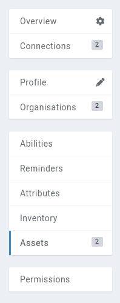

# Aliases

[Boosted campaigns](https://kanka.io/en-US/boosters) can set aliases on entities to help find them in the [search](/features/search) and in [mentions](/features/mentions).

## Defining an alias

To add an alias to an entity, navigate to that entity's **Assets** subpage.

From there, click on the **+ Alias** button on the top right.

Each alias has a [visibility](/advanced/visibility) option to control who in the campaign find the entity using the alias.

## Mentions with an alias

When adding a [mention](/features/mentions) to an entity through the alias, the alias's name is used to render the mention.

## What happens to the campaign's aliases when it is no longer boosted?

Should the campaign no longer be boosted, aliases won't work for both search and mentions. Boosting a campaign again will re-activate all the campaign's aliases.